# How ECG Machines Work Today & Doable Enhancements (15 Sep 2026)

<aside>
🛠️

**Why this page exists.** On 15 Sep 2026 the guide asked for an **upgrade to the existing idea** — early prediction or a software enhancement — because digitization and classification are common. Before choosing, this page explains how ECG machines work today, where they go wrong (with evidence), and which enhancements are doable for the team.

Sources marked **(opened)** were read at source; **(listing)** were seen only in search results — open before citing. PTB-XL counts marked **(our count)** were computed on 15 Sep 2026 from `ptbxl_database.csv` v1.0.3 downloaded from PhysioNet (21,799 records, 18,869 patients — matches the official figures).

Every "gap" means **not found in this check**, not "nobody has done it".

</aside>

---

# Part 1 — How ECG machines work today

## 1.1 Four kinds of ECG device

| Device | Where | What it records | What its software does |
| --- | --- | --- | --- |
| **Resting 12-lead ECG machine** | Clinic, OPD, emergency | About 10 seconds, 12 leads | Measures intervals, prints automatic diagnostic statements |
| **Bedside / ICU monitor, telemetry** | Ward, ICU | Continuous, usually fewer leads | Watches rhythm live and raises alarms |
| **Holter (ambulatory)** | Patient's normal day | A day or more (IRIDIA-AF records run 19–95 h) | Analysed afterwards for arrhythmias |
| **Wearables** | Smartwatch, patch | Single lead or beat-to-beat (RR) intervals | Rhythm checks; research models predict AF from RR intervals |

## 1.2 Inside a resting 12-lead machine — step by step

```mermaid
flowchart LR
  A["10 electrodes<br/>4 limbs + 6 chest"] --> B["Amplifier<br/>mV-level signal, noise rejection"]
  B --> C["Filters<br/>baseline wander, 50 Hz mains, muscle noise"]
  C --> D["Analogue-to-digital<br/>e.g. 500 samples/s"]
  D --> E["Beat detection<br/>+ representative median beat"]
  E --> F["Measurements<br/>HR, PR, QRS, QT/QTc, axis, amplitudes"]
  F --> G["Interpretation rules<br/>diagnostic statements"]
  G --> H["Print 25 mm/s, 10 mm/mV<br/>+ digital storage"]
  H --> I["Doctor over-reads<br/>and confirms"]
```

1. **Electrodes and leads.** Ten electrodes — four on the limbs, six on the chest — give the 12 standard leads: I, II, III, aVR, aVL, aVF from the limb electrodes, and V1–V6 from the chest.
2. **Amplifier.** The heart's signal on the skin is millivolt-level (the paper standard is 10 mm = 1 mV), so it is amplified, while interference common to all electrodes is rejected.
3. **Filters.** Remove baseline wander (breathing, movement), mains hum (50 Hz in India) and muscle noise. **Filter choice changes the waveform:** the AHA 2007 statement notes that "a 0.5-Hz low-frequency cut-off introduces considerable distortion into the ECG, particularly with respect to the level of the ST segment"; diagnostic recording uses a 0.05 Hz cut-off, while real-time monitor modes often use stronger filtering. In one study, 42 of 45 patients (93%) showed clinically significant ST changes that appeared only with the 0.5 Hz real-time filter. *(ISRN Cardiology 2012, opened — quoting AHA)*
4. **Digitisation.** The analogue signal is sampled — PTB-XL ECGs are stored at 500 Hz; the IRIDIA-AF Holter recordings at 200 Hz.
5. **Measurement.** Commercial programs such as the Glasgow program (Uni-G) and GE Marquette 12SL first build a **median beat**, extract features from it (heart rate, PR, QRS, QT, amplitudes) and then produce diagnostic statements. *(PTB-XL+ paper, opened)*
6. **Interpretation.** Criteria turn measurements into statements such as "sinus rhythm", "left bundle branch block" or "possible inferior infarct".
7. **Output.** The report is printed at 25 mm/s and 10 mm/mV with measurements and statements, and can be stored in standard digital formats — SCP-ECG (ISO/IEEE 11073-91064), DICOM waveform, HL7 aECG (used by the FDA for drug-trial ECGs) *(listing)* — inside ECG management systems such as GE MUSE or Philips IntelliSpace.
8. **Doctor over-reads.** "Millions of ECGs [are] recorded annually, with the majority automatically analyzed", and "over-reading and confirmation by an experienced ECG reader are essential". *(JACC 2017, opened — abstract)*

## 1.3 Inside a bedside monitor — live rhythm alarms

The monitor analyses the rhythm continuously and alarms on life-threatening patterns. The 2015 PhysioNet Challenge defined five such alarms: **asystole** (no QRS for at least 4 s), **extreme bradycardia** (below 40 bpm for 5 beats), **extreme tachycardia** (above 140 bpm for 17 beats), **ventricular tachycardia** (5 or more ventricular beats above 100 bpm) and **ventricular flutter/fibrillation** (at least 4 s). Its data came from bedside monitors of the three largest ICU monitor manufacturers. The problem it addressed: false alarms cause "desensitization to warnings and slowing of response times, leading to decreased quality of care". *(PhysioNet 2015 challenge page, opened)*

---

# Part 2 — Where today's systems go wrong

| Weak point | Evidence | Source |
| --- | --- | --- |
| **W1. Automatic interpretation is often wrong** | 39.5% of automatic interpretations wrong (208 of 526 patients; Spacelabs Cardioexpress SL12; Poland). Ischemia: 16.1% false positive, 22.3% missed. Errors higher above age 60 (46.4% vs 31.7%). Separately, the computer missed 30% of 340 confirmed STEMI cases, and physician reading cut door-to-balloon time from 113 to 85 min | Frontiers in Physiology 2025 (opened); Critical Pathways in Cardiology 2016 (opened — abstract) |
| **W2. Different programs measure differently** | Commercial programs differ by up to 14.0 ms (QRS) and 18.1 ms (QT) in long-QT patients; large errors differ up to two-fold between seven programs | Am Heart J 2014, 2018; J Electrocardiol 2020 (opened — abstracts) |
| **W3. Live filters distort the ST segment** | 0.5 Hz real-time filtering: clinically significant ST changes in 93% of 45 patients | ISRN Cardiology 2012 (opened) |
| **W4. Noisy recordings are common** | PTB-XL annotations: static noise in 3,260 records, baseline drift 1,598, burst noise 612, electrode problems 30, of 21,799. Lead reversal occurs in 0.4–4% of recordings | PTB-XL metadata (our count); PubMed 38663434 (listing) |
| **W5. Monitors raise false alarms** | Large enough a problem for a dedicated international challenge (2015) | PhysioNet 2015 (opened) |
| **W6. Each ECG is usually read on its own** | Serial comparison with the patient's previous ECG improves interpretation, but needs a prior ECG and dedicated software. In PTB-XL, **2,111 patients have 2 or more ECGs** (5,041 ECGs); **179** go from a NORM label on their first ECG to no NORM label on their last | J Electrocardiol 2012 (listing); Sbrollini et al. 2019 (opened — abstract); PTB-XL metadata (our count) |

---

# Part 3 — Doable enhancements

| Enhancement | Type | Fixes | Data | What already exists | Crowding | Doable in Phase I? |
| --- | --- | --- | --- | --- | --- | --- |
| **E1. "Second look" safety layer** — predicts when the machine's own report is likely wrong (recommended) | Software enhancement | W1, W2 | PTB-XL cardiologist labels + PTB-XL+ 12SL statements and Uni-G / 12SL / ECGDeli measurements (open, CC BY 4.0) | AI triage that gives its **own** diagnosis (DELTAnet 2023: trained on 336,835 ECGs, beat 12SL 0.96 vs 0.78); uncertainty for AI models. Predicting errors of the **existing machine's** statements — not found | Low–medium | Yes — CPU, tabular features |
| **E2. "Changed since last ECG" alert** | Early detection | W6 | PTB-XL: 2,111 patients with repeat ECGs (our count) | Deep-learning serial ECG analysis (2019, AUC 0.84 and 0.83 on two tasks); automated serial comparison (2012) | Medium | Partly — only 179 NORM-to-abnormal patients |
| **E3. AF early warning** — minutes before onset | Early prediction | New capability | IRIDIA-AF: 167 Holter records, 152 patients, 200 Hz, 10.5 GB, CC BY 4.0 (opened) | WARN (Patterns 2024): warns 30.8 min ahead on average, accuracy 83%, F1 85%, RR intervals; more studies in 2025 and 2026 | Medium–high | Yes, but needs a clear new angle |
| **E4. ST-safe live monitor filter** | Software enhancement | W3 | PTB-XL + MIT-BIH Noise Stress Test baseline-wander record (listing) | Real-time ST-preserving filters since 1991 (phase-compensated, 160 ms delay); wavelet methods | High — old field | Yes, low novelty |
| **E5. Record-time quality assistant** — "re-record" prompt for noise or swapped electrodes | Software enhancement | W4 | PTB-XL quality annotations (our count) | PhysioNet 2011 challenge on ECG quality (49 teams, 89–93% accuracy); lead-reversal detectors (2024) | Medium–high | Yes, as a Phase II module |

---

# Part 4 — Recommendation

<aside>
⭐

**E1 — a "second look" safety layer for existing ECG machines**, in Phase I. It is a software enhancement, not a new classifier: it does not replace the machine's diagnosis, it estimates **how likely that diagnosis is wrong** so the doctor checks the riskiest reports first.

It upgrades the existing idea: the clinical parameters (HR, PR, QRS, QT) and Option A's measurement disagreement become its inputs.

**Phase II:** add E2 (changed-since-last-ECG alert, the early-detection part) and E5 (record-time quality assistant) to make a complete assistant.

</aside>

## Why E1

- **The need is documented:** 39.5% wrong automatic interpretations in one 2025 study; 30% of confirmed STEMI missed in another; experts say every report must be over-read.
- **The data is open and ready:** PTB-XL has cardiologist labels; PTB-XL+ has the commercial 12SL statements and three algorithms' measurements for the same ECGs — so "machine wrong" can be defined per ECG and per diagnosis.
- **CPU only, no large training:** tabular features and light models.
- **Different from existing AI triage:** DELTAnet gives its own diagnosis; E1 checks the machine that clinics already use.

## Risks — say them plainly

- Cardiologist labels are the reference, but they are imperfect too.
- 12SL statements must be mapped to PTB-XL labels — PTB-XL+ provides SNOMED mappings, but mapping choices affect results.
- PTB-XL is German hospital data and 12SL is one vendor's program; results may not transfer to machines used in Indian clinics without testing.
- The guide may still see a model as "classification" — the framing is error prediction for an existing product.

## Draft title (not approved)

> **Which Automatic ECG Reports Need a Second Look? A Software Safety Layer that Predicts Errors in Built-in ECG Interpretation**
> 

## Draft problem statement (not approved)

Most ECGs are analysed automatically by software built into the ECG machine, and those automatic statements are often wrong: in a 2025 study of 526 patients, 39.5% of automatic interpretations were incorrect, and a 2016 study found that computer interpretation missed 30% of 340 confirmed STEMI cases. Experts therefore recommend that every automatic report be over-read, so doctors must check every report with equal care. AI triage systems address this by producing their own diagnosis instead of assessing the machine's report. This project builds a software layer that estimates, for each ECG, the risk that the machine's automatic interpretation is wrong — using the machine's own statements and measurements, disagreement between measurement algorithms, and signal-quality indicators — so that doctors can review the highest-risk reports first. It is developed and evaluated on PTB-XL, whose cardiologist labels, commercial 12SL statements and multi-algorithm measurements (PTB-XL+) are openly available.

## Draft objectives (not approved)

1. **Map where the built-in interpretation fails** — 12SL statements against cardiologist labels on PTB-XL, per diagnosis. *(Phase I)*
2. **Build an error-risk model** from machine statements and measurements, measurement disagreement between Uni-G, 12SL and ECGDeli, age, sex and signal-quality indicators. *(Phase I)*
3. **Evaluate it as an over-read triage tool** — the share of machine errors caught when doctors review the top-ranked reports first, and whether the risk scores are calibrated. *(Phase I)*
4. **Explain each flag in clinical terms** — for example "QTc near the cut-off; algorithms differ by 20 ms". *(Phase I → II)*
5. **Add early detection and quality modules** — changed-since-last-ECG alert (E2) and record-time quality assistant (E5). *(Phase II)*

---

# Part 5 — Before deciding

- [ ]  Guide chooses between E1–E5 and Options A–D (or a combination)
- [ ]  Project Coordinator approval for the change (General Guideline 3), recorded in the Log Book
- [ ]  Decide what Review II on 17 Sep presents
- [ ]  Open every (listing) source before citing it
- [ ]  Download PTB-XL+ and check the 12SL-to-PTB-XL label mapping before promising objective 1

---

# Sources

**Opened**

- [High-bandpass filters and ST distortion — ISRN Cardiology 2012](https://pmc.ncbi.nlm.nih.gov/articles/PMC3388307/)
- [Computer-interpreted ECGs: benefits and limitations — JACC 2017 (PubMed 28838369)](https://pubmed.ncbi.nlm.nih.gov/28838369/)
- [Physician vs computer interpretation in STEMI — 2016 (PubMed 26881816)](https://pubmed.ncbi.nlm.nih.gov/26881816/)
- [The most common errors in automatic ECG interpretation — Frontiers in Physiology 2025](https://pmc.ncbi.nlm.nih.gov/articles/PMC12137353/)
- [DELTAnet ECG triage implementation — EHJ Digital Health 2023](https://pmc.ncbi.nlm.nih.gov/articles/PMC10802816/)
- [Reducing false arrhythmia alarms in the ICU — PhysioNet 2015](https://moody-challenge.physionet.org/2015/)
- [Early warning of atrial fibrillation (WARN) — Patterns 2024 (PubMed 39005489)](https://pubmed.ncbi.nlm.nih.gov/39005489/)
- [IRIDIA-AF dataset — Zenodo](https://zenodo.org/records/8405941)
- [Serial ECG deep learning — BioMedical Engineering OnLine 2019 (PubMed 30755195)](https://pubmed.ncbi.nlm.nih.gov/30755195/)
- [PTB-XL v1.0.3 — PhysioNet](https://physionet.org/content/ptb-xl/1.0.3/)
- [PTB-XL+ v1.0.1 — PhysioNet](https://physionet.org/content/ptb-xl-plus/1.0.1/)
- [PTB-XL+ paper — Scientific Data 2023](https://pmc.ncbi.nlm.nih.gov/articles/PMC10183020/)

**Listing only — open before citing**

- [AHA/ACCF/HRS recommendations Part I, 2007 (PubMed 17341413)](https://pubmed.ncbi.nlm.nih.gov/17341413/)
- [SCP-ECG V3.0 — CinC 2016](https://www.cinc.org/archives/2016/pdf/090-500.pdf)
- [Real-time filter preserving ST accuracy — 1991 (PubMed 1836004)](https://pubmed.ncbi.nlm.nih.gov/1836004/)
- [Automated serial ECG comparison — 2012 (PubMed 22995382)](https://pubmed.ncbi.nlm.nih.gov/22995382/)
- [ECG quality from mobile phones — PhysioNet 2011](https://physionet.org/content/challenge-2011/1.0.0/)
- [MIT-BIH Noise Stress Test Database](https://www.physionet.org/physiobank/database/nstdb/)
- [Lightweight lead-misplacement detection — 2024 (PubMed 38663434)](https://pubmed.ncbi.nlm.nih.gov/38663434/)
- [Short-term AF onset prediction — EHJ Digital Health 2025](https://pmc.ncbi.nlm.nih.gov/articles/PMC12629655/)
- [Two-stage AF onset prediction on IRIDIA-AF — 2026](https://pmc.ncbi.nlm.nih.gov/articles/PMC13007920/)