# Review II — Presentation Content (17 Sep 2026)

<aside>
📅

**Review II — 17 September 2026** (date given by Rameshkumar on 14 Sep 2026).

The department schedule dated 15.07.2026 lists **14 & 15 September 2026**. Record here whether our batch slot moved, and keep the confirmation.

Department's expected outcome: *Validation of methodology, design and initial project implementation.*

</aside>

<aside>
🧭

**How to use this page.** Sections 1–11 follow the department's required order for Review II — one section per slide.

Every figure here is taken from a page in this workspace that already cites its primary source. Nothing was added from memory.

Sections marked **⛔** cannot be written from research: section 9 needs a real run, section 10 needs a team decision.

Each section ends with **→ Paper**, naming the section of the Scopus paper it feeds.

</aside>

<aside>
⚠️

**Review I was presented on the old welfare-scheme topic.** The Review I deck is titled *"Rule-Based Eligibility Explanation System for Government Welfare Schemes with Near-Miss Gap Analysis"* and dated 18-08-2026.

So the ECG problem statement, objectives, literature survey and research gap **have never been reviewed**. Review II is their first presentation. Expect questions on them. **The topic change was directed by the Review I panel, which gave this topic** (per Rameshkumar, 14 Sep 2026).

General Guideline 3 requires **prior Project Coordinator approval** for a change of title, scope or methodology. Because the panel itself directed the change, the practical step is to have that direction written down — Review I remarks or the Log Book.

</aside>

---

# 1. Brief Introduction & Problem Statement

**Slide points**

- Paper ECGs remain prevalent, especially in the Global South, while ECG interpretation algorithms expect time-series rather than images (Reyna et al., CinC 2024).
- In a clinic, a paper ECG becomes an image by being **photographed on a phone**.
- The printed grid is the only carrier of physical units — 25 mm/s and 10 mm/mV. If the grid is misjudged, every millivolt and millisecond is silently mis-scaled while the waveform still looks right.
- In the official PhysioNet Challenge 2024 score table, the winning digitization team scored **+4.930 dB on clean colour scans** and **negative SNR on every mobile-phone-photo category**.
- A recent open-source method reports **19.65 dB — explicitly on scanned paper**.

**Problem statement (approved 7 Sep 2026)**

> Twelve-lead ECGs in most Indian clinics exist only as paper printouts, and the practical way to move one between people or into software is to photograph it on a phone. Existing ECG digitization methods are developed and benchmarked almost entirely on flatbed scans, and they collapse when given a photograph: in the official score tables of the George B. Moody PhysioNet Challenge 2024, the top-ranked digitization team recorded a negative signal-to-noise ratio on every mobile-phone-photo category, while scoring around +4.9 dB on clean colour scans. Meanwhile a recently published open-source method reports 19.65 dB, but explicitly on scanned paper. The artefact that actually circulates in Indian clinical practice is therefore the one the field handles worst. This project builds an ECG digitization pipeline that is robust to phone-camera degradation — perspective distortion, glare, shadow, creasing and thermal-paper fade — and evaluates it on Indian ECG printout formats, which are absent from every public dataset. It then answers a question the literature has not cleanly settled: does digitizing an ECG photograph before classification actually improve diagnostic accuracy, or is it better to classify the photograph directly?
> 

**→ Paper:** Introduction.

---

# 2. Objectives

<aside>
⚠️

The objectives are still marked **draft** in the Review I Research Package. General Guideline 2 requires work on the *approved* objectives — get the guide's sign-off on these at or before Review II.

</aside>

| No. | Objective | Phase | Measured by |
| --- | --- | --- | --- |
| 1 | **Reproduce and benchmark** at least two open-source ECG digitization pipelines on public data, reporting SNR separately for each image type | Phase I | SNR (dB) per image type |
| 2 | **Define and validate a clinical-parameter error metric** — digitization error in heart rate (BPM) and PR, QRS and QT intervals (ms) — and report its relationship to SNR | Phase I | Error in BPM and ms; correlation with SNR |
| 3 | **Develop a photo-robustness front-end** — perspective rectification, grid recovery, illumination normalisation | Started Phase I, completed Phase II | SNR and clinical-parameter error recovered |
| 4 | **Construct an Indian ECG printout evaluation set** — printouts on Indian ECG grid stock, photographed under clinic conditions | Phase II | Performance on the Indian set versus the public benchmark |
| 5 | **Run a controlled three-arm comparison** — direct image classification, digitize-then-classify, fusion | Phase II | Macro F-measure on identical splits |

**→ Paper:** Introduction — the contributions list.

---

# 3. Research / Problem Gap

<aside>
🎯

Four of the five gaps are **quoted from the PhysioNet Challenge 2024 organisers' own Discussion section** — Reyna M.A. et al., CinC 2024. Lead with that: the gap is stated by the field, not asserted by us.

</aside>

**Gap 1 — The metric does not measure clinical usefulness.**

> "the SNR still does not directly capture or reflect clinical measurements that are likely to influence the downstream interpretation of an ECG"
> 

**Gap 2 — Nobody knows whether digitization is even necessary.**

> "several teams with negative SNR scores, i.e, more noise than signal, could achieve F-measure classification scores that were close to, but lower than, the highest-performing teams … it is more likely an indictment of our signal fidelity measure."
> 

**Gap 3 — Photographs are the unsolved case.** Winning team, official score table:

| Image type | SNR (dB) |
| --- | --- |
| Colour scans, clean paper | +4.930 |
| Black-and-white scans, clean paper | +3.479 |
| Colour scans, deteriorated paper | +0.506 |
| Mobile phone photo, clean paper | −1.071 |
| Mobile phone photo, stained paper | −0.723 |
| Mobile phone photo, deteriorated paper | −1.304 |
| Photo of a computer monitor | −1.759 |

> "PMcardio outperformed the Challenge algorithms but, like the Challenge teams, they demonstrated variable performance across the different variants of the hidden data."
> 

**Gap 4 — Reproducibility.**

> "we were unable to evaluate any of them, including ones for which code was available."
> 

**Gap 5 — Geography.** ECG-Image-Database covers Germany, the USA and Norway. No Indian ECG printouts appear in any public dataset.

<aside>
🚫

**Do not say these at the review** — each is easy to challenge:

- "Nobody can digitize phone photos" — PMcardio is a CE-marked Class IIb device that does
- "We beat the state of the art" — nothing has been measured yet
- "Risk prediction" — PTB-XL has diagnostic labels, no outcome or follow-up data
- "Clinically validated" — no clinician adjudication is planned
- "First to digitize ECG images" — the problem dates to at least ECGScan, 2005

**Say instead:** no *open, reproducible, independently evaluated* method reports per-image-type results for photographs, and none has been evaluated on Indian printouts or in clinical measurement units.

</aside>

**→ Paper:** Introduction and Related Work.

---

# 4. Proposed Solution

**Principle: compete where no numbers exist.** Beating 19.65 dB on scans means racing a funded lab with clinical data. Nobody has published per-image-type photo results, error in clinical units, or a per-factor robustness study — so those are the contribution.

| Contribution | What it is | Closes | Phase |
| --- | --- | --- | --- |
| **C1. Clinical-parameter error metric** (headline) | Run NeuroKit2 delineation on the ground-truth and the digitized signal; report error in BPM, ms and mV; correlate against SNR; report delineation failure rate as a result in its own right | Gap 1 | Phase I |
| **C2. Per-image-type benchmark** | Run open digitizers on matched scan-like and photo-like images of the same records; never report a single averaged number | Gap 3 | Phase I |
| **C3. Failure mechanism** | Separate segmentation error from calibration (grid-scale) error to show which stage breaks on photos; then compare calibration-pulse scaling against grid scaling as degradation rises | Gap 3 | Phase I → II |
| **C4. Three-arm classification** | Direct image vs digitize-then-classify vs fusion, identical patient-independent splits | Gap 2 | Phase II |
| **C5. Indian printout set** | Route A — print PTB-XL signals onto Indian ECG grid stock and photograph them. No patient data | Gap 5 | Phase II |
| **C6. Reproducible release** | Code, pinned dependencies, evaluation script and per-type result tables released | Gap 4 | Throughout |

**Why C1 leads:** it needs CPU only, no training and no new data; it answers a question the challenge organisers asked; and a metric contribution is one others must cite to use.

**→ Paper:** Introduction (contributions) and Methods overview.

---

# 5. Proposed Methodology

| Step | Method | Detail |
| --- | --- | --- |
| **M1. Ground truth** | Load PTB-XL signals with wfdb-python | 10 s, 12 leads, 500 Hz |
| **M2. Controlled images** | Render each record with ECG-Image-Kit, varying **one degradation factor at a time** | Calibration pulse, grid presence, grid colour (5), resolution, creases, black-and-white, handwriting, layout; bounding boxes stored as ground truth |
| **M3. Digitize** | Run baseline pipelines, inference only | ECG-Digitiser (Krones et al., BSD-2); Open-ECG-Digitizer (licence reads "Other" — read before use) |
| **M4. Align** | Resample and cross-correlation alignment of digitized output to ground truth | Comparison is meaningless without it |
| **M5. Signal metrics** | SNR to the challenge definition, PCC, RMSE | dB, dimensionless, mV — PCC is insensitive to amplitude scale errors, so it can look good while millivolts are wrong |
| **M6. Clinical metrics** | NeuroKit2 delineation of P, QRS and T onsets and offsets on both signals | HR (BPM); PR, QRS, QT (ms); ST deviation (mV) |
| **M7. Analysis** | Error decomposition; SNR-versus-clinical-error correlation; per-factor degradation table | Experiment Plan A1, A5, B1 |

**Hypotheses** — each stated so it can be falsified

- **H1** — For a fixed digitizer, SNR on phone photos is significantly lower than on scans of the same records *(Phase I)*
- **H2** — On photos the dominant error is calibration/geometry, not tracing *(Phase I)*
- **H3** — SNR correlates only weakly with error in clinically actionable parameters *(Phase I)*
- **H4** — Under photo degradation, direct image classification matches or beats digitize-then-classify *(Phase II)*
- **H5** — Digitizers tuned on European and US printouts lose accuracy on Indian formats *(Phase II)*

**Experimental rules**

1. Freeze a patient-independent dev set and test set at the start. The test set is touched once.
2. One variable per run.
3. Log every run, including failures, in the Progress Log.
4. Write the expected result before running.
5. Obey each experiment's stopping rule.
6. Always report per image type, never a single average.

**→ Paper:** Methods and Experimental Setup.

---

# 6. System Architecture / Block Diagram

```mermaid
flowchart LR
  A["PTB-XL<br/>ground-truth signals"] -->|"12-lead signal"| B["ECG-Image-Kit<br/>renderer"]
  B -->|"scan-like / photo-like image<br/>one factor varied"| C["Stage 1<br/>Semantic segmentation"]
  C -->|"class mask"| D["Stage 2<br/>Perspective correction"]
  D -->|"dewarped image"| E["Stage 3<br/>Layout identification"]
  E -->|"lead map"| F["Stage 4 — TARGET<br/>Grid size extraction<br/>+ calibration pulse"]
  F -->|"mm/s and mm/mV scale"| G["Stage 5<br/>Segmentation-to-trace"]
  G -->|"digitized signal"| H["Alignment<br/>resample + cross-correlation"]
  A -->|"ground truth"| H
  H -->|"aligned pair"| I["Signal metrics<br/>SNR, PCC, RMSE"]
  H -->|"aligned pair"| J["NeuroKit2<br/>delineation"]
  J -->|"HR, PR, QRS, QT, ST"| K["Clinical-parameter<br/>error"]
  I --> L["Per-image-type results<br/>SNR vs clinical error"]
  K --> L
  G -.->|"Phase II"| M["Three-arm<br/>classification"]
```

| Block | Input | Output | Status |
| --- | --- | --- | --- |
| Data & rendering | PTB-XL records | Matched image sets per degradation factor | Existing tools |
| Digitization pipeline, stages 1–5 | ECG image | 12-lead time-series | Existing baselines, run as-is |
| **Stage 4 — grid size extraction** | Dewarped image and lead map | mm/s and mm/mV scale factors | **Our target** — the only stage that decides what the ink means in physical units |
| Evaluation | Aligned ground-truth / digitized pairs | SNR, PCC, RMSE, clinical-parameter error | **Our contribution** — clinical-parameter error is new |

<aside>
🖍️

**For the slide:** redraw this as labelled boxes in Canva. Name every box, label every arrow, and visually mark Stage 4 and the clinical-parameter error block as the project's own work.

</aside>

**→ Paper:** Methods — Figure 1.

---

# 7. Tools & Technologies

| Tool | Used for | Licence | Note |
| --- | --- | --- | --- |
| Python, NumPy | All signal and array processing | — | Version to be pinned in the repository |
| Google Colab | Compute; GPU only where needed | — | Phase I work is CPU-feasible |
| wfdb-python | Reading PTB-XL records | MIT | Active |
| ECG-Image-Kit | Synthetic degraded ECG images, one factor at a time | BSD-3-Clause | Last commit Oct 2024 — expect dependency problems |
| ECG-Digitiser (Krones et al.) | Baseline — PhysioNet Challenge 2024 winner | BSD-2-Clause | Last push Jun 2025 |
| Open-ECG-Digitizer | Baseline — strongest open five-stage pipeline | **"Other" — read the LICENSE first** | Active |
| OpenCV | Hough transform, homography, grid geometry | — | Stages 2 and 4 |
| PyTorch | Running pretrained baselines — **inference only** | — | No training in Phase I |
| NeuroKit2 | ECG delineation for the clinical-parameter metric | MIT | The key enabler of Objective 2 |
| Git & GitHub | Shared codebase, reproducibility, audit trail | — | Supports Gap 4 |
| LaTeX / Overleaf, Zotero | Paper writing and references | — | Required by essentially every target venue |

**→ Paper:** Implementation details.

---

# 8. Dataset / Data Collection

| Dataset | Size and format | Licence | Role in project | Limitation |
| --- | --- | --- | --- | --- |
| **PTB-XL** | 21,799 records / 18,869 patients (PhysioNet v1.0.3); 10 s; 500 Hz and 100 Hz; 16-bit, 1 µV/LSB | CC BY 4.0 | Ground-truth signals and diagnostic labels | Diagnostic labels only — no outcome or follow-up data |
| **ECG-Image-Kit** output | Generated on demand, with lead bounding boxes | BSD-3-Clause | Controlled scan-like and photo-like image sets | Synthetic |
| **ECG-Image-Database** | 37,191 images / 2,243 records; Germany, USA, Norway | CC BY 4.0 | Real printed and photographed images for evaluation | No Indian printouts; software-generated labels |
| **PhysioNet Challenge 2024** score tables | Hidden set of 1,977 waveforms and 35,595 images | — | Evidence only — the official per-image-type scores behind Gap 3 | Not our result; label it clearly on slides |
| **Indian printouts (Route A)** | PTB-XL signals printed on Indian ECG grid stock, photographed | — | Geography evaluation | Phase II. No patient data, so no ethics-approval dependency |

<aside>
📌

**Cite the numbers carefully.** Use the PhysioNet PTB-XL count (21,799 / 18,869), which matches what is downloaded — the 2020 paper's 21,837 / 18,885 predates records being removed. Use the 2026 journal figure for ECG-Image-Database (37,191 / 2,243), not the 2024 challenge-time 35,595.

</aside>

**→ Paper:** Datasets.

---

# 9. Initial Design / Prototype ⛔

<aside>
⛔

**No prototype result is recorded anywhere in this workspace.** The last Progress Log entry (7 Sep 2026) says no baseline has been run, and the local project folder is empty.

This section must be filled **only** from a real run. Do not put a number on the slide that a run did not produce.

</aside>

**Minimum prototype to demonstrate** — in priority order

- [ ]  One PTB-XL record loaded and plotted with wfdb
- [ ]  One baseline digitizer running end to end on one image
- [ ]  Scan-like and photo-like images of the same records generated with ECG-Image-Kit
- [ ]  Baseline run on both categories, SNR computed per image type
- [ ]  **Chart: SNR per image type — the one thing that must exist**
- [ ]  Stretch: NeuroKit2 delineation on one ground-truth / digitized pair, showing HR and QRS error

**Results table — fill from the run**

| Image type | Records | Mean SNR (dB) | Run date and notes |
| --- | --- | --- | --- |
| Scan-like | — | — | — |
| Photo-like | — | — | — |

<aside>
🩹

**If the baseline will not run by 17 September:** present the design, and show the concrete failure — the error, the dependency, what was tried. That is honest, it is exactly what "Challenges Faced & Solutions" at Review III asks for, and it beats a polished diagram of something that does not run.

</aside>

**→ Paper:** Results — the first table and figure.

---

# 10. Work Completed & Individual Contribution ⛔

**Work completed** — evidenced in this workspace

- Topic re-scoped to ECG digitization; title and problem statement approved 7 Sep 2026 (verbal — no signed document on file)
- 20-paper literature survey for the ECG topic — 10 verified at source, 10 still to confirm
- Five research gaps, four quoted from the challenge organisers
- Study of the canonical five-stage pipeline and seven published methods, with a tool and licence audit
- Five falsifiable hypotheses and an experiment plan with stopping rules
- Learning path and a proposed division of work

**Individual contribution**

<aside>
⛔

The hub page records contributions as **"Not yet assigned"**. The split below is the **proposal** from the Learning Path page — the team must confirm or change it. Student Guideline 5 requires a clearly defined contribution per member, and Guideline 6 requires each member to explain their own work under questioning.

</aside>

| Member | Proposed ownership | Deliverable by Review III | Review II evidence (fill in) |
| --- | --- | --- | --- |
| **Rameshkumar K** (Team Leader) | Pipeline integration — baselines running, benchmark harness | Reproducible benchmark script producing per-image-type SNR | — |
| **Niranjana J** | Data and image degradation — ECG-Image-Kit, photo simulation, dataset construction | Image sets per category with documented generation parameters | — |
| **Risvanth V** | Clinical-parameter metric and evaluation — the headline contribution | Clinical-parameter error module and the SNR-versus-clinical-error analysis | — |

<aside>
🤖

**AI acknowledgement (Student Guideline 9).** The research, this page and the slide text were compiled with AI assistance. Every figure was checked against a primary source, but each member must still verify and understand what they present, and the use must be acknowledged as the institutional guidelines require.

</aside>

**→ Paper:** Author contributions and Acknowledgements.

---

# 11. Time Line

| Period | Work | Milestone |
| --- | --- | --- |
| Aug 2026 | Review I presented on the earlier welfare-scheme topic; topic changed to ECG digitization | Review I — 18 Aug |
| 1–13 Sep 2026 | ECG literature survey (20 papers), research gaps, title and problem statement approved, methodology and experiment plan | Research package complete |
| 14–17 Sep 2026 | Environment set up, baseline digitizer run, scan-versus-photo SNR chart | **Review II — 17 Sep** |
| 18 Sep – 9 Oct 2026 | Error decomposition (A1), clinical-parameter metric (A5), factorial robustness study (B1) started; target venue fixed with the guide | Preliminary results |
| 10 & 12 Oct 2026 | Results consolidated, Phase II plan, publication status | **Review III** — Phase I ends 12 Oct |
| Oct–Nov 2026 | Paper drafting and submission to a Scopus-indexed venue — indexing verified on the official Scopus source list | Submission |
| Phase II | Robustness front-end (A2, A3), Indian printout set (Route A), three-arm classification | Phase II reviews |

**→ Feeds:** Review III, "Work Completed vs. Planned Work". The Review I package planned a running baseline in the first two weeks of September — if it slips, say so at Review III rather than redrawing the chart.

---

# References for the slides

Use only references marked ✅ verified in the Research Package. The ⚠️ ones must be confirmed from full text before they go on a slide.

1. Reyna M.A. et al. *Digitization and Classification of ECG Images: The George B. Moody PhysioNet Challenge 2024.* Computing in Cardiology, 2024.
2. Shivashankara K.K., Deepanshi, Mehri Shervedani A., Clifford G.D., Reyna M.A., Sameni R. *ECG-Image-Kit.* Physiological Measurement, 45(5):055019, 2024.
3. *ECG-Image-Database.* Physiological Measurement, 47(7):075015, 2026. doi:10.1088/1361-6579/ae85b2
4. Wagner P. et al. *PTB-XL, a large publicly available electrocardiography dataset.* Scientific Data, 7:154, 2020. doi:10.1038/s41597-020-0495-6
5. *PTB-XL-Image-17K.* arXiv:2602.07446, 2026.
6. Krones F., Walker B., Lyons T., Mahdi A. *Combining Hough Transform and Deep Learning Approaches to Reconstruct ECG Signals From Printouts.* arXiv:2410.14185, 2024.
7. Yu X., Huang Y., Wu J., Wang J., Cai W. *From Paper to Digital: ECG Processing with U-Net Digitization and ResNet Classification.* Computing in Cardiology, 2024.
8. Shang H., Hutter C., Zhang Y. *Automated Digitization of Paper ECG Records Using Convolutional Networks.* Computing in Cardiology, 2024.
9. *Digitizing paper ECGs at scale: an open-source algorithm for clinical research.* npj Digital Medicine, 2025. arXiv:2510.19590
10. Karbasi R., Rahimi M., Vahabie A., Moradi H. *Deep Learning-Based Digitization of Overlapping ECG Images.* arXiv:2506.10617, 2025.

---

# Likely questions — and the sourced answer

| Question | Answer |
| --- | --- |
| Can't phone photos already be digitized? | Yes — PMcardio is CE-marked and handles smartphone photos, but it is closed source, and the organisers found its performance varied across image variants. No open, reproducible method reports per-image-type photo results. |
| Why not just build a better model? | The 19.65 dB state of the art is on scans, from a funded lab with clinical data. We compete where no numbers exist: clinical-unit error, per-type photo results, per-factor robustness. |
| Why target Stage 4? | The grid is the only carrier of physical units. Perspective makes grid spacing vary across the page, so one global scale factor is wrong by construction — while the trace still looks correct. |
| Why not risk prediction? | PTB-XL has diagnostic labels but no outcome or follow-up data, so it supports diagnostic classification, not risk prediction. |
| What about patient data and ethics? | Route A prints PTB-XL signals onto Indian grid stock — no patient data, so no ethics-approval dependency on the critical path. |
| Why did the topic change after Review I? | The Review I panel directed the change and gave this topic. Say so plainly, and point to where it is recorded. |
| Was AI used? | Yes, acknowledged. Every figure is traced to its primary source, and each member can explain their own part. |

---

# Before 17 September — checklist

- [ ]  Confirm the Review II date and slot — 17 Sep versus the schedule's 14–15 Sep
- [ ]  Share this page and the deck with the guide on 15 Sep and get his approval
- [ ]  Have the panel's topic direction recorded in writing (Review I remarks or Log Book)
- [ ]  Get the objectives approved by the guide
- [ ]  Run a baseline and fill section 9 with real numbers only
- [ ]  Agree individual contributions and fill section 10
- [ ]  Redraw the block diagram in Canva from section 6
- [ ]  Keep every ⚠️ unverified reference off the slides
- [ ]  Each member rehearses the whole pipeline, not only their own part
- [ ]  After the review: add a Progress Log entry — what was asked, what changed

---

# Slide map — Canva deck "Batch No: PROJ_006 - Review 02"

Built on 14 Sep 2026 from the Review I copy, keeping its layout. Every slide's text was replaced from the sections above; slides were reordered into the department's required Review II order and renumbered.

| Slide | Title | Source section | Status |
| --- | --- | --- | --- |
| 1 | Title slide | — | Review II, ECG title, domain, date 17-09-2026. **Time left as 10.00–10.50 AM from Review I — confirm our slot** |
| 2 | Team & guide | — | Title updated; team and guide unchanged |
| 3 | Introduction & Problem Statement | §1 | Done |
| 4 | Objectives | §2 | Done — guide approval still needed |
| 5 | Research / Problem Gap | §3 | Done — body text came out **bold**; reset it to regular in Canva |
| 6 | Proposed Solution | §4 | Done — "Phase I contributions:" came out bold; reset in Canva |
| 7 | Proposed Methodology | §5 | Done |
| 8 | System Architecture / Block Diagram | §6 | Table version only — **add a drawn block diagram from §6** |
| 9 | Tools & Technologies | §7 | Done |
| 10 | Dataset / Data Collection | §8 | Done |
| 11 | Initial Design / Prototype | §9 | ⛔ Placeholders — fill only from a real run |
| 12 | Work Completed & Individual Contribution | §10 | ⛔ "[To fill]" cells — needs team decision and evidence |
| 13 | Timeline | §11 | Done |
| 14 | References | References | Done — the 10 verified references only |
| 15 | Thank you | — | Unchanged |

<aside>
📚

**The 20-paper ECG literature survey is not in this deck.** Review II's required list does not include it, so the four survey slides were reused for architecture, tools, dataset and contribution. But Review I was presented on the welfare topic, so the ECG survey has never been shown to the panel. Keep the survey table from the Research Package ready as a backup slide in case they ask.

</aside>

---

# Update — 14 Sep 2026: final deck, 16 slides

**Topic change:** the Review I panel directed it and gave this topic. Get that written into the Review I remarks or the Log Book.

**Block diagram rebuilt.** The block diagram image added at slide 9 was squeezed into a strip 103 px tall across the full slide width, so it could not be read. It was removed (the image is still in Canva uploads) and replaced with a native, editable Canva diagram in three labelled rows: data preparation → five-stage digitization pipeline with Stage 4 highlighted in orange → evaluation, with our contribution in green. The table slide follows it as "Module Details".

## Review II requirement check

| Required item | Slide | Status |
| --- | --- | --- |
| 1. Brief Introduction & Problem Statement | 3 | Done |
| 2. Objectives | 4 | Done — guide approval pending |
| 3. Research / Problem Gap | 5 | Done — reset body text from bold to regular |
| 4. Proposed Solution | 6 | Done — reset "Phase I contributions:" from bold |
| 5. Proposed Methodology | 7 | Done |
| 6. System Architecture / Block Diagram | 8 and 9 | Done — diagram on 8, module details on 9 |
| 7. Tools & Technologies | 10 | Done |
| 8. Dataset / Data Collection | 11 | Done |
| 9. Initial Design / Prototype | 12 | ⛔ Placeholders — needs a real baseline run |
| 10. Work Completed & Individual Contribution | 13 | ⛔ "[To fill]" cells — needs team agreement |
| 11. Time Line | 14 | Done — row 1 now records that the panel directed the topic change |
| References / Thank you | 15 / 16 | Done |

**Still open before 17 Sep:** guide review on 15 Sep · baseline run for slide 12 · contribution split for slide 13 · objectives approval · Review II time slot on slide 1 (still shows Review I's 10.00–10.50 AM) · bold reset on slides 5 and 6.