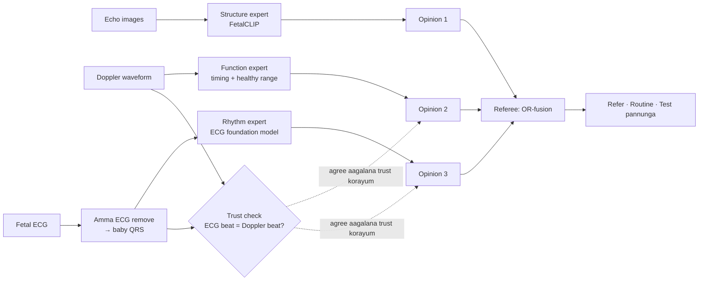

# Guide Briefing — Our Final Method in Tanglish (Structure–Function–Rhythm)

<aside>
🗣️

**Indha page enna?** Namma **final method** — Structure–Function–Rhythm (SFR) framework — step by step, Tanglish la. Guide kitta explain panna, review la defend panna, paper ezhudha. Ellaa numbers um source check pannadhu (Methodology Research page + Research Package). Method innum **guide + Coordinator approval** vaanganum (General Guideline 3).

</aside>

---

# 1. Oru line la

> **"Baby heart ah moonu vazhi la paakrom — echo (structure), Doppler (function), fetal ECG (rhythm). Moonu kum thani thani AI expert. Oru referee avanga opinions ah serthu mudivu edukkum: edhaavadhu oru expert problem sonnaa *refer*; oru test pannalana *'andha test um pannunga'* nu sollum — guess pannaadhu."**
> 

---

# 2. Problem — short aa

- **CHD** = baby pirakkum munnadiye heart la irukkura problem. Most common birth defect. India la varushathukku **2 lakh+ CHD babies** (Saxena 2018).
- Scan la **90%** kandupidikka mudiyum, nijathula **30% dhaan** catch aagudhu (Arnaout 2021).
- Doctors fetal heart la moonu vishayam paapaanga: **anatomy, function, rhythm** (AHA 2014).
- AI papers ellaam **oru input mattum** use panraanga. Moonum serthu panna study **illa** (2026 systematic review).
- Yen yaarum pannala? **Same baby ku moonu test um irukkura public dataset illa.** Namma method indha problem ah solve panra maadhiri design pannirukom.

---

# 3. Moonu input — enna, yen

| Input | Enna record aagudhu | Heart pathi enna solludhu | Endha form la use panrom |
| --- | --- | --- | --- |
| **Echo** (fetal echocardiography) | Heart oda photo — 4C, LVOT, RVOT, 3VT views | **Structure** — heart correct aa build aagirukka | Image |
| **Doppler** (pulsed-wave ultrasound) | Heart kulla blood evlo speed la flow aagudhu nu oru waveform | **Function** — heart fill aagi pump panra timing | 1-D signal (image illa) |
| **Fetal ECG** | Amma vayithula electrodes vechu baby heart oda electrical signal | **Rhythm** — heartbeat regular aa, speed correct aa | 1-D signal (image illa) |

<aside>
💡

**"Ultrasound" na yen Doppler?** Echo um ultrasound dhaan. Moonu *different* input venum na, rendaavadhu echo photo la theriyaadha vishayam kudukkanum — adhu Doppler flow waveform. Plus, fetal ECG oda **orey time la** record panna public data irukkuradhu Doppler ku mattum dhaan (NInFEA).

</aside>

---

# 4. Final method — full picture

---

# 5. Step by step

## Step 0 — Data ready panradhu

- PhysioNet la irundhu NInFEA, NIFEADB, CinC 2013 download (open, form venaam). Heartbeat ku form fill pannanum.
- **Split by patient / amma** — orey baby oda data train um test um la vara koodaadhu. Illana result fake aa high aagum.

## Step 1 — Fetal ECG clean panradhu

- **Input:** amma vayithu electrodes signal — adhula amma ECG (periya signal) + baby ECG (chinna signal) mix aagi irukkum.
- **Enna panrom:** amma chest channel la amma heartbeat kandupidichu, adha **subtract** panrom (template subtraction / ICA — already irukkura methods). Meedhi la baby **QRS** (heartbeat position) kandupidikkrom.
- **Output:** baby heartbeat times.
- **Yen pudhu network illa?** Extraction la already 22 studies irukku — adhu namma contribution illa.

## Step 2 — Rhythm expert

- **Input:** clean fetal ECG.
- **Enna panrom:** adult ECG la 10 million+ recordings la train aana **ECG foundation model** (ECGFounder, ECG-FM, HuBERT-ECG) — adha fetal ECG ku use panni oru chinna classifier head train panrom.
- **Compare:** simple HRV features model, 1D-CNN (baseline mattum) vs foundation models.
- **Data:** NIFEADB — 12 arrhythmia + 14 normal babies; leave-one-subject-out.
- **Output:** "rhythm abnormal aa" nu oru **opinion**.
- **Novelty:** adult ECG model fetal ECG ku transfer aagudha nu yaarum test pannala (namma check la). Work aagalanaalum adhu oru finding dhaan.

## Step 3 — Function expert (Doppler)

- **Input:** Doppler video frames → **velocity envelope** (1-D line).
- **Enna panrom:** ovvoru heartbeat cycle um kandupidikkrom; E wave, A wave (filling), ejection — timing measure panrom: cycle length, E/A ratio, AV interval, ejection time.
- **Healthy range:** NInFEA la 21–27 week healthy babies vechu normal range; adhukku veliya irundhaa flag.
- **Output:** "function normal range la irukka" nu opinion.
- **Limit:** NInFEA la healthy babies mattum dhaan — adhanaala idhu **disease diagnose pannaadhu**, "range ku veliya" nu mattum sollum.

## Step 4 — Trust check (namma special idea)

- ECG um Doppler um **orey heartbeat** ah measure panradhu — onnu electrical, onnu blood flow.
- Rendu um match aagudha nu beat-by-beat check panrom.
- **Match aagalana:** amma heartbeat ah baby nu thappa eduthirukkalaam, illa noise — appo andha rendu expert oda **trust (confidence) korachudrom**.
- **Yen mukkiyam:** amma–baby heartbeat confusion oru real clinical problem (Stampalija 2012). NInFEA use panna 30 papers la yaarum idha trust check aa use pannala.
- **Test:** NInFEA la orey time record aana ECG + Doppler irukku — real data la test panna mudiyum.

## Step 5 — Structure expert (echo)

- **Input:** 4 view images + 4 metadata (amma age, gestational age, cord vessels, growth percentile).
- **Enna panrom:** **FetalCLIP** — 2,10,035 fetal ultrasound images la pre-train aana model — adha CHD ku adapt panrom (linear head / LoRA). U-Net segmentation panna maatom.
- **Reference:** Heartbeat repo la **Heart-ViT trained weights already release pannirukanga** — train pannaamale compare pannalaam.
- **Trimester test:** 2nd trimester la train → 3rd trimester la test, and reverse.
- **Output:** "structural CHD" opinion.

## Step 6 — Referee (OR-fusion)

- Moonu opinion um serthu **final mudivu**: **Refer** / **Routine** / **Missing test pannunga**.
- Idhu thaan namma main contribution — keela detail aa.

---

# 6. "Opinion" na enna?

Ovvoru expert um verum yes/no sollaadhu. Moonu number kudukkum — mooninum total = 1:

| Part | Artham |
| --- | --- |
| **Belief (b)** | "Problem irukku" nu evlo nambikkai |
| **Disbelief (d)** | "Problem illa, normal" nu evlo nambikkai |
| **Uncertainty (u)** | "Enakku theriyala" — evidence pathala |
- Test **pannave illa** na: b = 0, d = 0, **u = 1** — "full aa theriyadhu". Idhu dhaan missing input ah handle panra trick.
- Idhu **subjective logic** nu oru established maths (Jøsang & McAnally 2004).

---

# 7. Referee eppadi mudivu edukkum?

**OR rule:** Structure **or** Function **or** Rhythm — edhaavadhu onnu la problem irundhaa, heart abnormal.

- **Problem belief** = 1 − (1 − b₁)(1 − b₂)(1 − b₃) — "at least one expert problem nu solludhu" nu artham.
- **Normal nu solla** — moonu perum normal nu sollanum. Oru test missing aa irundhaa, normal nu confident aa solla mudiyaadhu.
- Disbelief, uncertainty formulas: Jøsang & McAnally 2004 — implement panra munnadi paper padinga.

**Example — ivai example numbers dhaan, results illa:**

| Case | Structure (echo) | Function (Doppler) | Rhythm (ECG) | Referee mudivu |
| --- | --- | --- | --- | --- |
| A | b = 0.05 (normal maadhiri) | b = 0.10 | **b = 0.70** (heart block maadhiri) | Problem belief = 1 − 0.95 × 0.90 × 0.30 ≈ **0.74 → Refer** |
| B | Normal, confident | **Test pannala** (u = 1) | Normal, confident | Normal nu full confident illa → **"Doppler um pannunga"** |
| C | Normal | Normal | Normal — aana **trust check fail** (ECG beat ≠ Doppler beat) | ECG + Doppler uncertainty jaasthi → **"Test repeat pannunga"** |

<aside>
⚖️

**Yen "OR", "majority vote / Dempster" illa?** Moonu input um **different problems** ah paakkudhu. Heart structure correct aa irundhaalum heart block irukkalaam. Majority vote na "echo normal, Doppler normal, ECG abnormal" → normal nu mudivu pannidum — **alarm cancel aagidum**. OR rule alarm ah vidaadhu. Existing "trusted multi-view" papers (Han 2022; Zhou 2026) Dempster rule use panraanga — adhu orey vishayatha multiple views la paakkum podhu dhaan correct.

</aside>

---

# 8. Yen idhu, vera method illa?

| Vera method | Yen vendaam |
| --- | --- |
| Moonu features um concatenate panni oru big network | Same baby ku moonu data um venum — public la illa. Vera vera dataset la irundhu random aa match panna **fake patients** create aagum; reviewers reject pannuvanga |
| ECG → Doppler translate panradhu | Already 2 papers (2025, 2026) pannitaanga |
| Oru input ku pudhu CNN / 1D-CNN / U-Net | Panel sonna maadhiri — tons of papers. Baseline aa mattum use panrom |
| Echo labels vechu ECG model train panradhu | Paired ECG + echo venum — Phase II la hospital data kidaicha |

**Namma method best — yen:**

1. Ovvoru expert um **real data, real labels** la train — fake patients illa.
2. **Paired patients theva illa** — referee ku training venaam.
3. **Novel:** moonu input serkradhu, paired data illaama fusion, ECG foundation model on fetal ECG, ECG–Doppler trust check — ellaam namma check la not found.
4. **India reality ku fit:** PHC la Doppler/ECG irukkum, echo tertiary hospital la mattum — missing test normal vishayam.
5. **Moonu per ku moonu expert** — individual contribution clear.
6. Echo data late aanaalum ECG + Doppler open data la **ippove start** pannalaam.

---

# 9. Data — edhu edhukku

| Dataset | Enna irukku | Endha expert ku | Access |
| --- | --- | --- | --- |
| **Heartbeat** | 6,215 echo images, 4 views, 2T + 3T; **Heart-ViT trained weights um release pannirukanga** | Structure — main data | Form |
| **CARDIUM** | 6,558 images, 1,103 patients; 26 amma clinical variables (JSON public aa repo la irukku); 321 babies 2nd + 3rd trimester rendu layum scan | Structure — second source, overlap check apram mattum | Form (images) |
| **NInFEA** | Fetal ECG + Doppler orey time la; 60 recordings, 39 ammas; healthy only | Function + trust check | Open |
| **NIFEADB** | Fetal ECG; 12 arrhythmia + 14 normal | Rhythm | Open |
| **CinC 2013** | Fetal ECG, 75 recordings with correct QRS answers | Step 1 test panna | Open |

<aside>
⚠️

**Heartbeat–CARDIUM overlap:** rendu um orey lab, orey scanners, orey years (2019–2023), 3rd trimester la almost same count (690 / 50 CHD vs 684 / 50 CHD). Same patients irukkalaam — **check pannaama onna vechu innonna test pannaadheenga.** Heartbeat 2T test la **6 CHD babies dhaan** — oru baby miss aanaa sensitivity 16.7% kurayum; adhanaala cross-validation results um serthu report pannuvom.

</aside>

---

# 10. Trial runs — simple aa

- **R (ECG):** amma ECG remove panra 3 methods compare → baby QRS → simple features vs 1D-CNN vs 3 foundation models → segment split vs patient split (fake high accuracy eppadi varudhu nu kaatta) → calibration.
- **F (Doppler):** envelope → 3 cycle detectors (ECG heartbeat vechu check) → timings → healthy range.
- **C (Trust check):** ECG vs Doppler heart rate → vendumne corrupt panna pairs ah kandupidikkudha → false alarms kurayudha.
- **S (Echo):** Heart-ViT released weights → ImageNet vs FetalCLIP → views combine → metadata → trimester shift → calibration.
- **X (Referee):** max / noisy-OR / subjective-logic OR / Dempster / learned stacker compare → 7 missing-test combinations → simulation (simulation nu clear aa label panni).

Full list: Experiment Plan page.

---

# 11. Yaar enna panranga (proposal — team aa confirm pannunga)

- **Rameshkumar** — Structure expert (echo, FetalCLIP) + Referee (fusion)
- **Niranjana** — Rhythm expert (fetal ECG) + data management
- **Risvanth** — Function expert (Doppler) + trust check + calibration

Ovvoru per um full pipeline ah explain panna therinjirukkanum.

---

# 12. Review II questions ku answer

- **"1D CNN papers tons"** → "Aamaa sir. 1D-CNN baseline mattum. Pretrained ECG foundation model fetal ECG la work aagudha nu test panrom — namma check la yaarum pannala."
- **"Medical always U-Net"** → "Segmentation panna maatom sir. FetalCLIP foundation model; contribution fusion dhaan."
- **"ECG digital aa irukkum podhu yen image?"** → "Correct sir. ECG um Doppler um 1-D signal aa dhaan. Echo mattum image — machine la irundhe image aa varudhu."
- **"Connected Papers?"** → "10 seed papers vechu graph build panrom sir; OpenAlex citation map already pannitom."

---

# 13. Guide kitta kekka vendiyadhu

- [ ]  Structure–Function–Rhythm method OK va?
- [ ]  Coordinator approval eppadi vaanganum? (General Guideline 3)
- [ ]  Heartbeat / CARDIUM form la supervisor aa unga peru podalaama?
- [ ]  Review III publication status ku, ECG + Doppler open-data parts vechu oru early conference paper podalaama?
- [ ]  Endha venue prefer panreenga?

---

# 14. Idhu mattum sollaadheenga

<aside>
🚫

- "AI CHD ah diagnose pannum" — screening + referral support mattum
- "Fetal ECG / Doppler vechu structural CHD kandupidikkum" — thappu
- "Moonu test um panna real patients la test pannitom" — andha data illa; Phase II la hospital data venum
- "Doppler expert disease kandupidikkum" — healthy range ku veliya nu mattum sollum
- "Heartbeat um CARDIUM um independent datasets" — overlap check pannala innum
</aside>

---

# 15. 1-minute script

> "Sir, CHD ah nijathula 30% dhaan catch panranga, possible 90%. Doctors fetal heart la anatomy, function, rhythm moonu paapaanga — adhukku echo, Doppler, fetal ECG. AI papers ellaam oru input mattum use panraanga; moonum serthu panna study illa, yenna same baby ku moonu test irukkura public data illa. Namma method: moonu input kum thani expert — echo ku FetalCLIP, ECG ku pretrained ECG foundation model, Doppler ku timing analysis. ECG um Doppler um orey heartbeat ah paakkudha nu trust check. Kadaisi la oru referee — OR rule: edhaavadhu oru expert problem sonnaa refer; test missing na andha test pannunga nu sollum. Paired patients theva illa. ECG, Doppler open data la ippove start pannalaam; echo ku Heartbeat form fill pannanum — adhula trained Heart-ViT weights um irukku. Unga approval um Coordinator approval um venum sir."
>