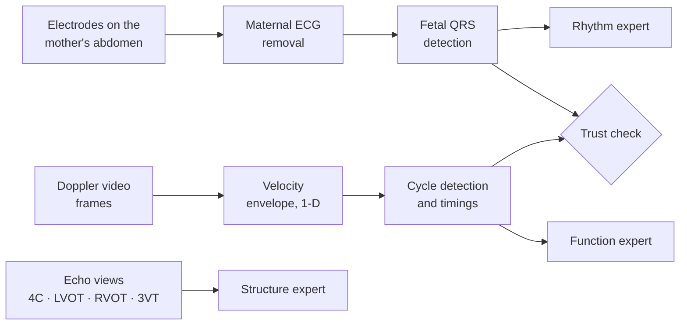

# How Prenatal Heart Screening & AI Work Today

<aside>
⚙️

**Purpose.** How the fetal heart is checked before birth with three inputs — echocardiography, Doppler ultrasound and fetal ECG — how AI is applied to each today, and direct answers to the Review II questions. Every figure is from a paper checked at source; full citations are in the Research Package and on the Methodology Research page.

</aside>

---

# 1. The clinical pathway

1. **Routine anomaly scan.** Screening ultrasound examines standard views of the heart (Arnaout's data came from 18–24-week fetuses).
2. **Suspicion → fetal echocardiography**, a specialised ultrasound of the fetal heart that assesses **anatomy, function and rhythm** (AHA scientific statement, 2014).
3. **Rhythm problems** are assessed with Doppler or M-mode timing; **fetal ECG** and magnetocardiography are complementary tools for rhythm (AHA 2014).
4. **Confirmed CHD →** counselling, delivery planning and neonatal care.

<aside>
🎯

**The weak point is step 1.** Five screening views could detect 90% of complex CHD, but in practice sensitivity is as low as 30% (Arnaout et al., Nature Medicine 2021). A missed case never reaches step 2. In India the three tests sit at different levels of care, so most women have only some of them.

</aside>

---

# 2. The three inputs

| Input | How it is recorded | What it shows | Public data |
| --- | --- | --- | --- |
| **Echocardiography** | Ultrasound probe on the abdomen; 2D views | **Structure** — chambers, valves, great vessels | Heartbeat, CARDIUM (request forms); FOCUS (open) |
| **Doppler ultrasound** | Pulsed-wave Doppler in the five-chamber view; flow across the mitral and aortic valves | **Function** — filling (E and A waves), ejection, mechanical heart rate, AV interval | NInFEA (open, healthy only, synchronised with fetal ECG) |
| **Fetal ECG** | Electrodes on the mother's abdomen; maternal and fetal signals mixed | **Rhythm** — fetal heart rate, regularity, conduction | NIFEADB (arrhythmia labels), NInFEA, CinC 2013 (open) |

---

# 3. The standard echo views

| View | What it shows | In Heartbeat (single-view results) |
| --- | --- | --- |
| **4C** — four-chamber | The four chambers, the valves and the septum | Underperformed |
| **LVOT** — left ventricular outflow tract | The aorta leaving the left ventricle | Best F1 (81.82%) |
| **RVOT** — right ventricular outflow tract | The pulmonary artery leaving the right ventricle | Highest sensitivity (87.50%) |
| **3VT** — three-vessel-trachea | Pulmonary artery, aorta and superior vena cava in relation to the trachea | Underperformed |

---

# 4. How AI is applied today

| Input | Family | Examples | State |
| --- | --- | --- | --- |
| Echo | CHD classification | Arnaout 2021; Tang 2023; Lei 2025; meta-analysis 2025 | **Crowded** |
| Echo | Segmentation (U-Net-style) | Nurmaini 2021; Lu 2024 | **Crowded** — the panel's "medical always U-Net" |
| Echo | Image + clinical fusion; normal-only video models; phase detection | CARDIUM 2025; Heart-ViT 2026; Saha 2025; ORBIT 2026 | **Done** |
| Echo | Foundation model | FetalCLIP 2026 (CHD test on internal data only) | New |
| Fetal ECG | Extraction, QRS detection, arrhythmia classification | 22 studies in a 2026 review; at least 15 NIFEADB arrhythmia papers | **Crowded** — the panel's "1D-CNN, tons" |
| Fetal ECG | CHD detection | de Vries 2023 — private data | Blocked by data |
| Doppler | Cardiac time intervals; arrhythmia | HR-IQS 2024; Yang 2024 — private data | **Done** |
| Fetal ECG + Doppler | ECG → Doppler translation | Verma 2025; Su 2026 (NInFEA) | **Taken** |
| **All three** | **Fusion without paired patients; trust check; missing inputs** | None found | **This project** |

---

# 5. Pipelines, input by input

- **Heart-ViT** (the published echo baseline): a vision transformer with clinical metadata through adaptive instance normalisation. 2nd-trimester test (61 patients): sensitivity 79.17%, specificity 93.18%, AUROC 88.56%, F1 65.63%. Its authors did not study cross-dataset validation, uncertainty or calibration.
- **Fetal ECG vs Doppler timing** (Nii et al., Heart 2006): the ECG PR interval could be measured in only 61% of examinations, and Doppler AV intervals track it only loosely. So the trust check compares **beat timing and heart rate**, which both inputs measure well, not the PR interval.

---

# 6. Review II questions — answered

| Panel's point | Our answer |
| --- | --- |
| "Use Connected Papers to check similar papers" | Ten seed papers across the three inputs, plus an OpenAlex citation map — see the Novelty Check page |
| "1D-CNN-related papers — there are tons" | Agreed. A 1D-CNN appears only as a baseline. The rhythm expert tests pretrained ECG foundation models — not found for fetal ECG in our check |
| "Medical imaging always uses U-Net" | Agreed — we do not segment. The echo expert adapts a fetal-ultrasound foundation model; the contribution is the fusion of three inputs |
| "ECG signals are already digital — why image-type questions?" | Every input stays in its native form. Fetal ECG and the Doppler envelope are processed as 1-D signals; only echo, which the machine produces as images, is handled as images |