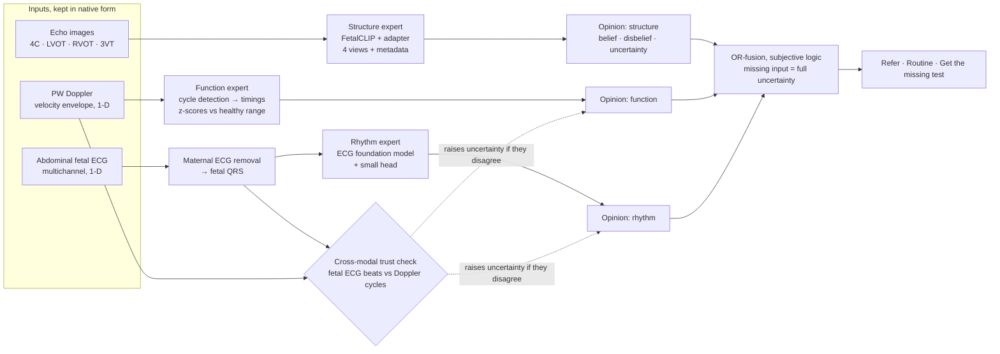

# Methodology Research — ECG + Doppler Ultrasound + Echo: Best Method & Trial Runs

<aside>
🧬

**Purpose.** On 19 Sep 2026 the team decided the project uses **three inputs: fetal ECG, ultrasound and fetal echocardiography**. This page checks what other papers already do with each input and recommends **one methodology** — why it is the best choice, how to build it, and which trial runs are needed. Every figure was checked at source on 19 Sep 2026. "Open" means **not found in our check**, never "nobody has done it".

</aside>

<aside>
🚩

**Status: recommendation, not yet approved.** A change of methodology needs the guide's approval and **prior Project Coordinator approval** (General Guideline 3).

</aside>

---

# 1. What the three inputs are

| Input | What it records | What it tells us about the heart | Form we keep it in |
| --- | --- | --- | --- |
| **Fetal ECG** — non-invasive, electrodes on the mother's abdomen | Electrical activity of the fetal heart, mixed with the mother's ECG | **Rhythm** and conduction — heart rate, regularity, heart block | 1-D multichannel signal |
| **Doppler ultrasound** — pulsed-wave, five-chamber view, flow across the mitral and aortic valves | Blood-flow velocity through the heart over time | **Function** — filling and ejection timing, mechanical heart rate, atrioventricular (AV) interval | 1-D velocity envelope — a signal, not a picture |
| **Fetal echocardiography** — 2D views 4C, LVOT, RVOT, 3VT | Pictures of the heart's anatomy | **Structure** — where most CHD shows | Images |

<aside>
💡

**Why "ultrasound" means Doppler here.** Echocardiography is itself ultrasound. For three *different* inputs, the second one must add what the echo pictures do not show — the Doppler flow waveform. It is also the only input with public data recorded **at the same time** as fetal ECG (NInFEA).

</aside>

<aside>
🩺

**Clinical anchor.** The AHA scientific statement on fetal cardiac disease (Donofrio et al., *Circulation* 2014) describes a fetal echocardiogram as assessing **cardiac anatomy, cardiac function and rhythm**, with fetal ECG and magnetocardiography as complementary tools for rhythm. Our three inputs map onto those three parts: **Structure** (echo), **Function** (Doppler), **Rhythm** (fetal ECG).

</aside>

---

# 2. The data reality — this decides the methodology

| Dataset | Input(s) | Size | Labels | Access |
| --- | --- | --- | --- | --- |
| Heartbeat | Echo — still images, 4 views — plus 4 metadata fields (gestational age, maternal age, umbilical vessels, growth percentile) | Paper: 1,475 patients — 2nd trimester 785 (6.50% CHD), 3rd 690 (7.25%). Released files: 2T 723 + 61 test patients (44 + 6 CHD); 3T 690 (50 CHD), no 3T test split | CHD vs normal | Request form |
| CARDIUM | Echo images (4 views, plus colour and power Doppler stills; views not labelled in the files) + 26 maternal clinical variables | 6,558 images; 1,103 patients (74 CHD in the public files, 79 in the paper); 1st trimester 101, 2nd 694, 3rd 684; 321 patients scanned in both 2nd and 3rd | CHD vs normal | Request form |
| FOCUS | Echo — 4C only | 300 images | Heart and thorax outlines, cardiothoracic ratio | Open |
| **NInFEA** | Fetal ECG (27 channels, 2048 Hz) **with synchronised pulsed-wave Doppler** (five-chamber window; video at 60 Hz; envelopes at 284 samples/s) | 60 entries from 39 women, weeks 21–27; 7.5–119.8 s each | **Healthy fetuses only** | Open (ODC-By 1.0) |
| **NIFEADB** | Fetal ECG (4–5 abdominal + 1 maternal chest channel; 500 Hz or 1 kHz) | 12 arrhythmia + 14 normal-rhythm recordings | Rhythm | Open (ODC-By 1.0) |
| PhysioNet/CinC Challenge 2013, set A | Fetal ECG (4 abdominal channels, 1 kHz, 1 minute) | 75 recordings | Reference fetal QRS positions | Open (ODC-By 1.0) |
| FECGSYNDB | Synthetic fetal ECG | 1,750 signals (per the 2026 review) | Known ground truth | Open |

<aside>
🧱

**The hard fact.** No public dataset has all three inputs for the same fetus. No public fetal ECG or Doppler dataset has CHD labels. Only NInFEA pairs two inputs (fetal ECG + Doppler), and only in healthy fetuses. **Any methodology that needs the same fetus measured three ways cannot be trained or tested on public data.**

</aside>

## 2.1 The two GitHub repositories — checked 19 Sep 2026

|  | **Heartbeat** — [github.com/BCV-Uniandes/Heartbeat](https://github.com/BCV-Uniandes/Heartbeat) | **CARDIUM** — [github.com/BCV-Uniandes/Cardium](https://github.com/BCV-Uniandes/Cardium) |
| --- | --- | --- |
| After the form | 6,215 PNG images (2.1 GB), metadata CSV, fold CSVs; **Heart-ViT weights for both trimesters (4 folds each)** and 5 baseline models for the 2nd trimester | 6,558 JPEG images arranged by fold / CHD / patient; image, tabular and fusion model weights |
| Public without the form | Code only | Code, **the clinical JSON files** (1,104 records, 29 fields) and a trimester file listing every patient's images |
| Patients | 2T: 723 cross-validation + 61 test (44 + 6 CHD). 3T: 690 cross-validation only (50 CHD) | 1,103 patients, 74 CHD in the public files: 1st trimester 101 (5 CHD), 2nd 694 (46), 3rd 684 (50). **321 patients (25 CHD) appear in both 2nd and 3rd trimester** |
| Views | 4C, LVOT, RVOT, 3VT — the view is in each filename | Same four views per the paper, plus colour and power Doppler stills. **No view labels in the files** |
| Clinical data | Maternal age, gestational age, three-vessel cord, growth percentile | 26 maternal variables: blood counts, BMI, obstetric history, lifestyle and risk factors, pathological, hereditary and drug history |
| ECG, spectral Doppler, video | None | None — colour Doppler still images only |
| CHD subtypes | Not released | 11 types + "other" in the paper; not in the public files |
| Licence | Data: academic use through the form. **Code has no licence file** | Code Apache-2.0; data CC BY-NC 4.0 |
| **Use for us** | **Main data for the structure expert.** The released weights give run S2 and a first trimester-shift result without training | A second echo source **only if overlap with Heartbeat is ruled out**; same-fetus 2nd → 3rd trimester consistency; a first-trimester look (5 CHD — descriptive only); clinical variables as an optional prior for fusion |

<aside>
⚠️

**Heartbeat and CARDIUM probably overlap.** Same lab, same scanners (Voluson E6/E8/E10), overlapping years (CARDIUM's ultrasound dates are mostly 2019–2023; Heartbeat's are 2019–2023), and near-identical cohorts — 3rd trimester: CARDIUM 684 patients / 50 CHD, Heartbeat 690 / 50. This is a suspicion from the numbers, not proof. Until an image-hash check (run D4) or the authors say otherwise, **never use one as an external test for the other**.

</aside>

<aside>
📏

**Heartbeat's 2nd-trimester test has only 6 CHD patients** — one missed case moves sensitivity by 16.7 points. Report pooled out-of-fold predictions (50 CHD in each trimester) with confidence intervals next to the official test result.

</aside>

<aside>
🔢

Counts differ slightly between the papers and the released files (Heartbeat 785 vs 784 second-trimester patients; CARDIUM 79 vs 74 CHD). Cite each paper's figures for its results; report the counts we actually receive for ours.

</aside>

<aside>
🚫

**Neither repository helps the rhythm or function experts** — no ECG and no spectral Doppler waveform. Those stay on NInFEA, NIFEADB and CinC 2013.

</aside>

---

# 3. What other papers already do

| Area | Evidence | Status |
| --- | --- | --- |
| CHD classification from fetal echo | Arnaout 2021 (Nature Medicine); 15-study meta-analysis 2025; 51 OpenAlex matches, 36 since 2023 | **Crowded** |
| Echo segmentation (U-Net-style) | Nurmaini 2021; Lu 2024 | **Crowded** |
| Echo image + clinical fusion | CARDIUM 2025; Heart-ViT 2026 | **Done** by the dataset authors |
| Normal-only (anomaly) CHD detection in echo video | Saha et al. 2025 (Oxford; 5 hospital sites; private data) | **Done** |
| Cardiac-phase detection in fetal echo without an ECG | ORBIT — Medical Image Analysis 2026 | **Done** |
| Fetal ECG extraction and QRS detection | 2026 systematic review: 22 AI studies | **Crowded** |
| Fetal arrhythmia classification from fetal ECG (NIFEADB) | At least 15 papers citing NIFEADB, 2021–2026 — 1D-CNN, BiLSTM, capsule, spiking and graph networks; e.g. 96.2% accuracy with a 1D-CNN on 26 subjects (per the 2026 review) | **Crowded** — the panel's "1D-CNN, tons" |
| Arrhythmia and timing from pulsed-wave Doppler | Yang 2024, Medical Image Analysis (3,850 cases); HR-IQS, Heart Rhythm 2024 (6,498 spectra, 2,630 fetuses, 14 centres) | **Done** — on private data |
| Translating fetal ECG into Doppler | Verma et al. 2025 (LNCS); Su et al. 2026 (EMBC; 885 segments, 39 pregnancies — NInFEA) | **Taken** |
| CHD from fetal ECG | de Vries 2023: 122 measurements (65 healthy, 57 CHD), sensitivity 63%, specificity 77%; private data | Blocked by data |
| Uncertainty-aware multi-view fusion within echo | Zhou et al. 2026 (arXiv; five views; private data) | Emerging |
| Fetal-ultrasound foundation model | FetalCLIP (npj Digital Medicine 2026): 210,035 images; CHD linear probe AUROC 78.72% on 418 internal 4C videos; weights public, non-commercial licence | New — **not tested on public CHD data** in our check |
| **Any system combining fetal ECG + Doppler + echo** | 2026 systematic review: no multimodal fusion studies; Europe PMC: 0–2 matches | **Open** |
| **Multimodal learning without paired patients (missing inputs) in fetal cardiology** | 0 matches on Europe PMC and arXiv | **Open** |
| **ECG foundation models transferred to fetal ECG** | 0 matches on Europe PMC and arXiv; the 2026 review does not mention foundation models | **Open** |
| **Fetal ECG–Doppler agreement used as a trust check** | None of the 30 papers citing NInFEA; maternal–fetal heart-rate confusion is a documented problem (Stampalija 2012) | **Open** |

---

# 4. Methodologies we considered

| # | Methodology | Verdict | Why |
| --- | --- | --- | --- |
| M1 | One network that concatenates fetal ECG, Doppler and echo features | ❌ | Needs the same fetus measured three ways, which does not exist publicly. Randomly matching samples from different datasets **invents patients**; the network then learns relationships that are not real. Reviewers reject this |
| M2 | Translate one input into another (fetal ECG → Doppler) | ❌ as headline | Done twice on NInFEA (2025, 2026) |
| M3 | One input alone with a new network (echo CNN, fetal-ECG 1D-CNN, Doppler model) | ❌ as headline | The crowded work the panel pointed at. Kept only as **baselines** inside each expert |
| M4 | Normal-only anomaly detection | 🟡 optional | Done for echo video and Doppler by strong groups. For fetal ECG, NInFEA and NIFEADB use different devices, so "abnormal" could just mean "different machine" |
| M5 | Tiered referral chain: community fetal ECG / Doppler → anomaly scan → echo | 🟡 framing | The right story for India, but it cannot be validated end-to-end. Used as the deployment scenario, not as the ML contribution |
| M6 | Train a fetal-ECG model with labels taken from echo, as done for adult ECG | ❌ Phase II | Needs paired fetal ECG + echo — possible only with hospital data |
| **M7** | **Structure–Function–Rhythm experts + a cross-modal trust check + uncertainty-aware OR-fusion** | ✅ **Recommended** | Trainable and testable on public data — section 5 |

---

# 5. Recommended methodology — the Structure–Function–Rhythm (SFR) framework

## 5.1 The idea

<aside>
🧒

**Simple version.** Three specialists, each trained on its own data, each says *normal*, *abnormal* or *not sure*. A referee checks whether the ECG and the Doppler agree about the heartbeat. The final decision refers the baby if **any** specialist finds a problem, and asks for the missing test when it does not know enough.

</aside>

**Technical version.** Each input gets its own expert, built on a pretrained foundation model and trained only on real, labelled data for that input. Each expert outputs a **calibrated opinion** — belief, disbelief and uncertainty. Where two inputs measure the same thing (heart timing in fetal ECG and Doppler), their **agreement** sets how far we trust them. A fusion rule from **subjective logic** combines the opinions with **OR semantics** — the heart is abnormal if structure *or* function *or* rhythm is abnormal. A missing input counts as full uncertainty. The output is **refer**, **routine**, or **get the missing test**.

## 5.2 Architecture

## 5.3 Layer by layer

| Layer | What it does | Data | Built from |
| --- | --- | --- | --- |
| 1. Preprocessing | Fetal ECG: maternal QRS from the chest channel → template subtraction or ICA → fetal QRS detection. Doppler: velocity envelope from the video frames. Echo: view-labelled images | NInFEA, NIFEADB, CinC 2013; Heartbeat | Established tools (FECGSYN toolbox algorithms, NeuroKit2, the NInFEA envelope tool). **No new extraction network** |
| 2a. Structure expert | Probability of structural CHD per patient, from 4 views + metadata | Heartbeat (+ CARDIUM) | FetalCLIP image encoder with a linear head or LoRA adapter; ImageNet models and Heart-ViT as baselines |
| 2b. Function expert | Cycle length, E/A ratio, mechanical AV interval, ejection time, QRS-to-ejection delay → z-scores against a gestational-age healthy range | NInFEA (healthy, weeks 21–27) | Signal processing + normative regression. Says "outside the healthy range" — **does not diagnose** |
| 2c. Rhythm expert | Probability of an abnormal rhythm | NIFEADB, leave-one-subject-out | ECG foundation models — ECGFounder and ECG-FM (MIT licence), HuBERT-ECG (non-commercial) — + a small head. HRV-feature model and a 1D-CNN only as baselines |
| 3. Cross-modal trust check | Beat-by-beat agreement between fetal ECG and Doppler timing. Catches maternal–fetal heart-rate confusion, noise and lost signal | NInFEA — the only synchronised pair | Agreement statistics; optionally a small self-supervised matched-vs-shifted model |
| 4. Fusion and decision | OR-combination of the three opinions; a missing input is a vacuous opinion; thresholds set for a target sensitivity | Each expert's own calibration split | Subjective logic (Jøsang & McAnally 2004); temperature scaling (Guo 2017); conformal risk control (Angelopoulos 2022), optional |

## 5.4 Why OR-fusion — not feature concatenation, not Dempster consensus

- **Feature concatenation needs paired patients** (M1).
- **Trusted multi-view methods** (Han et al., *IEEE TPAMI* 2022; Zhou et al. 2026 for fetal echo) combine views with Dempster's rule, which suits several views of the **same** thing. Our inputs look at **different** things: a structurally normal heart with complete heart block is still abnormal. A consensus rule treats "echo normal, ECG abnormal" as conflict and can cancel the alarm. **OR-fusion keeps it.**
- **OR-fusion needs no training on paired data** — each expert trains alone, so the missing paired data stops being a blocker.
- **A missing input becomes full uncertainty**, so the system says "get the missing test" instead of guessing. In India that is the normal case, because the three tests sit at different levels of care.

## 5.5 Why this is the best choice

1. **Valid with the data that exists** — every expert trains on real labels; no invented patients.
2. **Novel where it matters** — the four open points in section 3 — while every building block is established and citable, so the failure risk is low.
3. **Answers all four Review II points** — the Connected Papers map; no new 1D-CNN (only as a baseline, with foundation-model transfer instead); no U-Net; signals stay signals, images stay images.
4. **Clinically grounded** — it matches the AHA's anatomy, function and rhythm. India has more than 200,000 CHD births a year at 9 per 1,000 (Saxena, *Indian Pediatrics* 2018).
5. **Three clear individual contributions** — one expert each (Student Guideline 5).
6. **Degrades gracefully** — if echo access is late, the rhythm expert, the function expert and the trust check still run on open data now.

## 5.6 Novelty claims — each means "not found in our check"

1. The first framework to combine non-invasive fetal ECG, Doppler ultrasound and fetal echocardiography for prenatal heart screening.
2. A fusion that needs **no paired patients** and handles **any missing input**, with OR semantics suited to different cardiac conditions.
3. The first test of whether **adult ECG foundation models transfer to fetal ECG**.
4. **Fetal ECG–Doppler agreement as a trust check**, validated on synchronised recordings.
5. The first evaluation of a **fetal-ultrasound foundation model on public CHD data**, including shift between trimesters.

**Not claimed:** diagnosing CHD · detecting structural CHD from fetal ECG or Doppler · clinical validation of the fused system on real patients who had all three tests · validity for Indian hospitals without Indian data.

## 5.7 Honest limitations — write these in the paper

- **The fused system cannot be validated on real patients with all three inputs** — none exist publicly. Each expert is tested on real data, the trust check on real paired data, and the fusion by its formal properties plus simulated cohorts built from real expert outputs — labelled as simulation everywhere.
- **The function expert can only say "outside the healthy range"** — NInFEA has no abnormal fetuses and covers weeks 21–27 only.
- **NIFEADB has 26 subjects**, so confidence intervals will be wide.
- **Heartbeat and CARDIUM come from the same lab** — patient overlap must be checked.
- **Real validation needs Phase II hospital data:** ethics approval, consent, a PCPNDT-registered facility, and no fetal-sex information in any record.

---

# 6. How to approach it

| Phase | Dates | What | Output |
| --- | --- | --- | --- |
| Start | 19–26 Sep | Approvals; access forms; download NInFEA, NIFEADB, CinC 2013; preprocessing (fetal ECG extraction, Doppler envelopes); split files | Data cards, split files |
| Build the experts | 27 Sep – 5 Oct | Rhythm runs R; function runs F; trust-check runs C; structure runs S once echo access arrives | First results with confidence intervals |
| Fuse | 3–8 Oct | Fusion runs X: rule comparison, missing-input matrix, simulation | Fusion table |
| Review III | 10 & 12 Oct | Preliminary results; publication plan | Deck; Methods and Results draft |
| Phase II | 2027 | Paired hospital data (ethics, consent, PCPNDT); real-patient validation; training the ECG expert with echo labels (M6) | Full validation |

<aside>
🧭

**Order rule:** open data first — the R, F and C runs need no forms — and gated data (S) when it arrives.

</aside>

---

# 7. Trial-and-error runs — summary

Full run cards, with expected results and stopping rules, are on the **Experiment Plan** page.

| Family | Runs | What we compare | Keep rule |
| --- | --- | --- | --- |
| **R** — rhythm (fetal ECG) | R1–R7 | Extraction: template subtraction vs ICA vs template subtraction + PCA · QRS detection · HRV + logistic regression vs 1D-CNN vs 3 ECG foundation models (frozen, then fine-tuned) · segment-level vs subject-level split · calibration | The simplest model within the best model's confidence interval |
| **F** — function (Doppler) | F1–F4 | Envelope tool vs Python port · 3 cycle detectors checked against fetal-ECG beats · timing measures · healthy range | Cycle-detection F1 ≥ 0.9, otherwise drop the fine intervals |
| **C** — trust check | C1–C3 | Heart-rate agreement · 3 agreement scores on deliberately corrupted pairs · false alarms with vs without the check | Must cut false alarms on healthy NInFEA |
| **S** — structure (echo) | S1–S9 | ImageNet vs Heart-ViT vs DINOv2 / BiomedCLIP vs FetalCLIP (probe, LoRA) · view aggregation · metadata · trimester shift · calibration and uncertainty | Patient-level AUROC and sensitivity with confidence intervals |
| **X** — fusion | X1–X4 | Max vs noisy-OR vs subjective-logic OR vs Dempster vs a learned stacker · 7 missing-input patterns · simulated cohorts · conformal thresholds | Best sensitivity at a matched referral rate, with honest uncertainty |

---

# 8. Proposed individual contributions — confirm as a team

| Member | Owns | Runs |
| --- | --- | --- |
| **Rameshkumar K** | Structure expert (echo, FetalCLIP) and the fusion layer | S1–S9, X1–X4 |
| **Niranjana J** | Rhythm expert (fetal ECG extraction, foundation-model transfer) and data management | R1–R7, data cards, splits |
| **Risvanth V** | Function expert (Doppler), the cross-modal trust check, calibration | F1–F4, C1–C3 |

Every member must still be able to explain the whole pipeline.

---

# 9. Sources

✅ = citation confirmed and abstract or dataset page read on 19 Sep 2026. 🟡 = citation metadata confirmed only — read the paper before citing it.

**Clinical and data**

- ✅ Donofrio M.T. et al. *Diagnosis and treatment of fetal cardiac disease: a scientific statement from the American Heart Association.* Circulation, 2014. doi:10.1161/01.cir.0000437597.44550.5d
- ✅ Saxena A. *Congenital heart disease in India: a status report.* Indian Pediatrics, 2018. doi:10.1007/s13312-018-1445-7
- ✅ Sulas E. et al. *A non-invasive multimodal foetal ECG–Doppler dataset for antenatal cardiology research.* Scientific Data, 2021. doi:10.1038/s41597-021-00811-3 — dataset: [physionet.org/content/ninfea](http://physionet.org/content/ninfea)
- ✅ Behar J.A. et al. *Noninvasive fetal electrocardiography for the detection of fetal arrhythmias.* Prenatal Diagnosis, 2019. doi:10.1002/pd.5412 — dataset: [physionet.org/content/nifeadb](http://physionet.org/content/nifeadb)
- ✅ Silva I. et al. *Noninvasive fetal ECG: the PhysioNet/Computing in Cardiology Challenge 2013.* Computing in Cardiology, 2013 — dataset: [physionet.org/content/challenge-2013](http://physionet.org/content/challenge-2013)
- ✅ Rodríguez S. et al. *Heartbeat.* Frontiers in Cardiovascular Medicine, 2026. doi:10.3389/fcvm.2026.1726484
- ✅ Vega D. et al. *CARDIUM.* arXiv:2510.15208, 2025
- ✅ *Pre-Conception and Pre-Natal Diagnostic Techniques (Prohibition of Sex Selection) Act, 1994* — India Code

**Literature map**

- ✅ Țarălungă D.D. et al. *A systematic review on AI-driven noninvasive fetal ECG processing and analysis methods.* Frontiers in Digital Health, 2026. doi:10.3389/fdgth.2026.1926578
- ✅ de Vries I.R. et al. *Fetal electrocardiography and artificial intelligence for prenatal detection of congenital heart disease.* Acta Obstet Gynecol Scand, 2023. doi:10.1111/aogs.14623
- ✅ Maani F. et al. *FetalCLIP: a visual-language foundation model for fetal ultrasound image analysis.* npj Digital Medicine, 2026. doi:10.1038/s41746-026-02907-9 — arXiv:2502.14807
- ✅ Saha P. et al. *Self-supervised normality learning and divergence vector-guided model merging for zero-shot congenital heart disease detection in fetal ultrasound videos.* arXiv:2503.07799, 2025
- ✅ Yang Y. et al. *Orientation-robust latent motion trajectory learning for annotation-free cardiac phase detection in fetal echocardiography (ORBIT).* Medical Image Analysis, 2026. [doi:10.1016/j.media.2026.104288](https://doi.org/10.1016/j.media.2026.104288)
- ✅ Yang X. et al. *Hierarchical online contrastive anomaly detection for fetal arrhythmia diagnosis in ultrasound.* Medical Image Analysis, 2024. [doi:10.1016/j.media.2024.103229](https://doi.org/10.1016/j.media.2024.103229)
- ✅ Yang X. et al. *An intelligent quantification system for fetal heart rhythm assessment: a multicenter prospective study.* Heart Rhythm, 2024. doi:10.1016/j.hrthm.2024.01.024
- ✅ Verma A. et al. *Towards reconstruction of pulsed-wave Doppler signals from non-invasive fetal ECG.* LNCS, 2025. doi:10.1007/978-3-031-87663-9_32
- ✅ Su T. et al. *Cross-modal generative framework for signal translation from fetal–maternal electrocardiograms to fetal Doppler waveforms.* arXiv:2607.08073, 2026 (EMBC 2026)
- ✅ Zhou T. et al. *Trusted multi-view deep learning classification of fetal congenital heart disease.* arXiv:2606.15265, 2026
- ✅ Megahed Y. et al. *Automated classification of first-trimester fetal heart views using ultrasound-specific self-supervised learning (USF-MAE).* arXiv:2512.24492, 2025
- ✅ Nii M. et al. *Assessment of fetal atrioventricular time intervals by tissue Doppler and pulse Doppler echocardiography.* Heart, 2006. doi:10.1136/hrt.2006.093070 — ECG PR measurable in only 61% of exams; Doppler AV intervals track ECG PR only loosely
- ✅ Stampalija T. et al. *Fetal and maternal heart rate confusion during intra-partum monitoring.* J Matern Fetal Neonatal Med, 2012. doi:10.3109/14767058.2011.636090
- ✅ Li J. et al. *ECGFounder.* arXiv:2410.04133 — weights on Hugging Face, MIT licence

**Methods**

- 🟡 Jøsang A., McAnally D.S. *Multiplication and comultiplication of beliefs.* Int J Approximate Reasoning, 2004. doi:10.1016/j.ijar.2004.03.003 — the subjective-logic OR operator
- 🟡 Han Z. et al. *Trusted multi-view classification with dynamic evidential fusion.* IEEE TPAMI, 2022. doi:10.1109/tpami.2022.3171983
- 🟡 Sensoy M. et al. *Evidential deep learning to quantify classification uncertainty.* NeurIPS 2018; arXiv:1806.01768
- 🟡 Wu R. et al. *Deep multimodal learning with missing modality: a survey.* arXiv:2409.07825, 2024
- 🟡 Coppola E. et al. *HuBERT-ECG.* medRxiv, 2024. doi:10.1101/2024.11.14.24317328 — weights CC BY-NC 4.0
- 🟡 Andreotti F. et al. *An open-source framework for stress-testing non-invasive foetal ECG extraction algorithms.* Physiological Measurement, 2016. doi:10.1088/0967-3334/37/5/627
- 🟡 ECG-FM — weights at [huggingface.co/wanglab/ecg-fm](http://huggingface.co/wanglab/ecg-fm) (MIT); cite the paper named on that page
- ✅ Guo C. et al. 2017, arXiv:1706.04599 · Angelopoulos A.N. et al. 2022, arXiv:2208.02814 — already in the Research Package

<aside>
⚖️

**Licences to respect.** FetalCLIP and HuBERT-ECG weights are **non-commercial** (FetalCLIP's paper states CC BY-NC-ND 4.0, its Hugging Face page CC BY-NC 4.0 — read the licence file). Academic research use is fine; do not redistribute fine-tuned FetalCLIP weights without checking.

</aside>