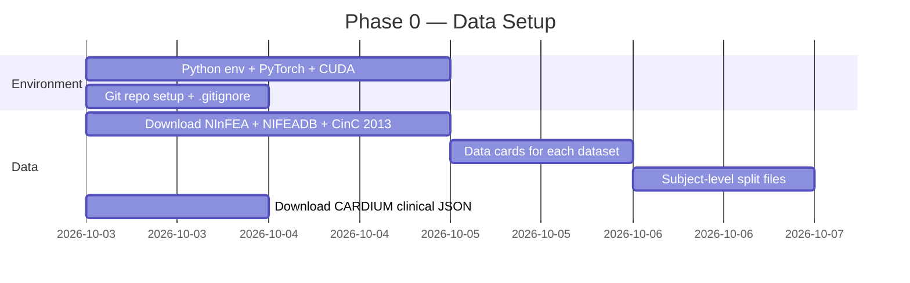

# 🫀 Implementation Plan — Structure–Function–Rhythm (SFR) Framework

> **Project:** Uncertainty-Aware Fusion of Fetal Echocardiography, Doppler Ultrasound and Non-Invasive Fetal ECG for Prenatal Heart Screening Without Paired Data

---

## Models We're Going to Try

Your documentation explicitly rejects standalone 1D-CNN as a headline contribution (the panel called it "tons"). Instead, the novelty comes from **foundation-model transfer**, **cross-modal trust**, and **uncertainty-aware OR-fusion**. Here's every model in the pipeline:

### 🔵 Rhythm Expert (Fetal ECG) — Niranjana

| Model | Role | Why |
|---|---|---|
| **ECGFounder** (Li et al. 2024) | ⭐ Primary candidate | 10M+ adult ECGs, single-lead, MIT licence, Hugging Face weights. Frozen embeddings → linear head, then LoRA fine-tune |
| **ECG-FM** (Wang Lab) | ⭐ Primary candidate | MIT licence, multi-lead. Frozen probe → compare with ECGFounder |
| **HuBERT-ECG** (Coppola 2024) | ⭐ Candidate (non-commercial) | HuBERT-style self-supervised on ECG. CC BY-NC — fine for academic use |
| HRV features + Logistic Regression | Baseline only | Traditional approach — the "what everyone does" |
| Random Forest on HRV | Baseline only | Slightly stronger ML baseline |
| 1D-CNN from scratch | **Baseline only** ❌ not headline | The panel's "tons" — kept to show foundation models beat it |

> [!IMPORTANT]
> **The novelty:** No one has tested whether adult ECG foundation models transfer to fetal ECG. Even a negative result ("they don't transfer") is publishable. The 1D-CNN exists only to lose.

### 🟢 Function Expert (Doppler) — Risvanth

| Component | What It Is | Model? |
|---|---|---|
| Envelope extraction | Otsu threshold + area opening + edge detection on Doppler video frames | **Signal processing — no ML model** |
| Cycle detection | Peak-based / template matching / autocorrelation | **Signal processing — 3 algorithms compared** |
| Timing measurement | Cycle length, E/A ratio, mechanical AV interval, ejection time, QRS-to-ejection delay | **Derived features** |
| Healthy-range model | Gestational-age regression (weeks 21–27) → z-score flagging | **Linear/polynomial regression** |

> [!NOTE]
> This expert is intentionally **not** a deep learning model. NInFEA has only 60 healthy recordings — the strength is in clinical interpretability (z-scores against published HR-IQS ranges), not in a black-box network.

### 🔴 Structure Expert (Echo) — Rameshkumar

| Model | Role | Why |
|---|---|---|
| **FetalCLIP** (Maani 2026) | ⭐ **Primary — the novel backbone** | 210K fetal ultrasound images; CLIP-style; CHD linear probe AUROC 78.72%. First time tested on public CHD data across trimesters |
| FetalCLIP + **LoRA adapter** | ⭐ Best expected performer | Parameter-efficient fine-tuning on Heartbeat |
| **Heart-ViT** (released weights) | Reference / upper bound | No training needed — load weights, score. Reproduces published numbers |
| **DINOv2** (Meta) | Control foundation model | General vision — expected to lose to FetalCLIP (proves fetal-specific pretraining matters) |
| **BiomedCLIP** | Control foundation model | Biomedical but not fetal-specific |
| ResNet-50 (ImageNet) | Baseline | Standard transfer learning |
| ViT-B (ImageNet) | Baseline | Transformer baseline |

> [!IMPORTANT]
> **The novelty:** First evaluation of FetalCLIP on public CHD data AND across trimesters (2nd→3rd shift). Heart-ViT is the reference to beat, not our contribution.

### 🟡 Cross-Modal Trust Check — Risvanth

| Method | What It Does |
|---|---|
| Heart-rate difference (simple) | \|HR_ECG − HR_Doppler\| |
| Beat-train cross-correlation | Temporal alignment of fetal ECG R-peaks vs Doppler cycle peaks |
| Small self-supervised model | Trained on matched vs time-shifted pairs (optional, only if simple methods aren't sufficient) |

### 🟣 Fusion / Referee — Rameshkumar

| Fusion Rule | Role | Why Compare |
|---|---|---|
| **Subjective Logic OR** (Jøsang 2004) | ⭐ **Primary — the headline** | Keeps alarms when only one expert flags; missing input = full uncertainty |
| Max rule | Baseline | Simplest OR |
| Noisy-OR | Baseline | Probabilistic OR |
| **Dempster's rule** | Comparison target | Used by Zhou 2026 / Han 2022 — but cancels alarms across different conditions |
| Logistic regression stacker | Comparison target | Shows a learned model gains nothing without real paired data |
| Conformal risk control (optional) | Threshold calibration | Target 95%/90% sensitivity per input pattern |

---

## Implementation Roadmap

### Phase 0: Data & Environment Setup (Days 1–5)



**Tasks:**
1. Set up Python environment: `Python 3.10+`, `PyTorch 2.x`, `CUDA 12.x`
2. Install core packages: `wfdb`, `neurokit2`, `open_clip`, `transformers`, `scikit-learn`, `scipy`, `matplotlib`
3. Download open datasets via `wfdb` from PhysioNet
4. Create **subject-level splits** (critical — no leakage)
5. Write data cards

### Phase 1: Signal Preprocessing (Days 3–8)

**1A. Fetal ECG Extraction (Runs R1–R2)**
```
Input: Raw abdominal ECG (mother + baby mixed)
├── Maternal chest channel → detect maternal QRS
├── Method 1: Template subtraction
├── Method 2: FastICA
├── Method 3: Template subtraction + PCA
└── Output: Fetal QRS positions
    └── Evaluate: F1 against CinC 2013 set A references (±50ms)
```

**1B. Doppler Envelope Extraction (Run F1)**
```
Input: NInFEA Doppler video frames (60 Hz)
├── Otsu thresholding
├── Morphological area opening
├── Edge detection → velocity envelope (1-D)
└── Validate against MATLAB envelope tool output
```

### Phase 2: Build the Three Experts (Days 6–16)

#### 2A. Rhythm Expert — Fetal ECG (Runs R3–R7)

```python
# Pseudocode for the progression:

# R3: Baselines (NIFEADB, leave-one-subject-out)
baseline_1 = HRVFeatures() → LogisticRegression()
baseline_2 = HRVFeatures() → RandomForest()
baseline_3 = CNN1D(from_scratch=True)  # ← exists only to lose

# R4: Leakage check
# Same 1D-CNN with segment split vs subject split → show the gap

# R5: Foundation model probes (THE NOVELTY)
ecgfounder = load_pretrained("ECGFounder")  # resample to model's rate
ecgfm = load_pretrained("ecg-fm")
hubertecg = load_pretrained("HuBERT-ECG")
# Freeze → extract embeddings → LogisticRegression head
# Compare AUROC vs R3 baselines

# R6: Fine-tune best R5 model (LoRA or last blocks)
# Only if R5 > R3

# R7: Calibration → temperature scaling → opinion (b, d, u)
```

> [!TIP]
> **Key resampling detail:** Each foundation model expects a specific sampling rate (ECGFounder: likely 500Hz, ECG-FM: check model card, HuBERT-ECG: check model card). NIFEADB is 500Hz/1kHz. Resample before feeding.

#### 2B. Function Expert — Doppler (Runs F2–F4)

```python
# F2: Cycle detection (3 methods, use fetal ECG R-peaks as reference)
method_1 = peak_based_detection(envelope)
method_2 = template_matching(envelope)
method_3 = autocorrelation_detection(envelope)
# Measure: cycle F1 ≥ 0.9 required

# F3: Timing measures per cycle
timings = {
    "cycle_length": ...,
    "e_a_ratio": ...,
    "av_interval": ...,
    "ejection_time": ...,
    "qrs_to_ejection_delay": ...
}
# Sanity check against HR-IQS reference ranges

# F4: Healthy range model
# Regression: timing ~ gestational_age (weeks 21-27)
# z-score = (observed - predicted_mean) / predicted_std
# Flag if |z| > threshold
# Test on: held-out healthy women + synthetically altered envelopes
```

#### 2C. Structure Expert — Echo (Runs S1–S9, needs Heartbeat access)

```python
# S1: ImageNet baselines per view
resnet50 = torchvision.models.resnet50(pretrained=True)
vit_b = timm.create_model("vit_base_patch16_224", pretrained=True)
# Fine-tune on Heartbeat, mean over 4 views per patient

# S2: Heart-ViT reference (NO TRAINING — just load weights)
heart_vit = load_released_weights("heartbeat_repo/weights/")
# Score on cross-val + 61-patient test → reproduce published numbers

# S3: FetalCLIP linear probe (THE NOVELTY)
fetal_clip = open_clip.create_model("FetalCLIP")
# Freeze → extract per-view embeddings → LinearHead per view

# S4: FetalCLIP + LoRA
# LoRA rank=8 on attention layers → fine-tune

# S5: Control models
dinov2 = torch.hub.load("facebookresearch/dinov2", "dinov2_vitb14")
biomedclip = open_clip.create_model("BiomedCLIP")

# S6: View aggregation
# Mean / max / attention pooling across 4 views
# Drop each view at inference → robustness

# S7: Add 4 metadata features (maternal age, GA, cord, growth)

# S8: Trimester shift test
# Train on 2T → test on 3T, and vice versa
# FetalCLIP vs ImageNet → does fetal pretraining reduce the shift?

# S9: Calibration → temperature scaling → opinion (b, d, u)
```

### Phase 3: Cross-Modal Trust Check (Days 12–15, Runs C1–C3)

```python
# C1: Heart-rate agreement (NInFEA)
# Bland-Altman: fetal HR from ECG vs Doppler

# C2: Agreement scoring
score_1 = abs(hr_ecg - hr_doppler)
score_2 = cross_correlation(ecg_beat_train, doppler_cycle_train)
score_3 = self_supervised_model(matched_vs_shifted_pairs)  # optional
# Test on deliberately corrupted pairs

# C3: Trust gate effect
# With trust check: if score < threshold → raise uncertainty on function + rhythm
# Measure: false alarm rate on healthy NInFEA
```

### Phase 4: Fusion / Referee (Days 14–18, Runs X1–X4)

```python
# Each expert outputs opinion: (belief, disbelief, uncertainty)
# where b + d + u = 1

# Subjective Logic OR-fusion:
# Combined belief = 1 - (1-b1)(1-b2)(1-b3)
# Missing input → (b=0, d=0, u=1)

# X1: Compare fusion rules
rules = [max_rule, noisy_or, subjective_logic_or, dempster, learned_stacker]
# Measure: sensitivity at matched referral rate

# X2: Missing-input matrix (7 combinations)
combos = [
    (S, F, R), (S, F, _), (S, _, R), (_, F, R),
    (S, _, _), (_, F, _), (_, _, R)
]

# X3: Simulated cohorts
# 1000 bootstrap cohorts from real expert outputs
# Prevalence: 9/1000 (Saxena) and enriched 10%
# ⚠️ Label as SIMULATION everywhere

# X4 (optional): Conformal thresholds for 95%/90% sensitivity
```

---

## Project Structure

```
c:\Finalyearproject\
├── data/                          # NOT in git (licence terms)
│   ├── ninfea/                    # PhysioNet download
│   ├── nifeadb/                   # PhysioNet download
│   ├── cinc2013/                  # PhysioNet download
│   ├── heartbeat/                 # Request form (when granted)
│   └── cardium_clinical/          # Public JSON
├── splits/                        # Subject-level split files (in git)
├── src/
│   ├── preprocessing/
│   │   ├── fetal_ecg_extraction.py
│   │   ├── doppler_envelope.py
│   │   └── echo_preprocessing.py
│   ├── experts/
│   │   ├── rhythm_expert.py       # ECG foundation models
│   │   ├── function_expert.py     # Doppler timing + z-scores
│   │   └── structure_expert.py    # FetalCLIP + baselines
│   ├── trust_check/
│   │   └── cross_modal_trust.py   # ECG-Doppler agreement
│   ├── fusion/
│   │   ├── subjective_logic.py    # Opinions + OR-fusion
│   │   ├── fusion_rules.py        # All rules for comparison
│   │   └── decision.py            # Refer / Routine / Get test
│   ├── evaluation/
│   │   ├── metrics.py             # AUROC, sensitivity, specificity, CI
│   │   ├── calibration.py         # ECE, Brier, temperature scaling
│   │   └── bootstrap.py           # Bootstrap confidence intervals
│   └── utils/
│       ├── data_loading.py
│       └── config.py
├── notebooks/                     # Experiment notebooks per run
│   ├── R1_maternal_ecg_removal.ipynb
│   ├── R3_rhythm_baselines.ipynb
│   ├── R5_foundation_model_probe.ipynb
│   ├── F1_envelope_extraction.ipynb
│   ├── S3_fetalclip_probe.ipynb
│   └── X1_fusion_comparison.ipynb
├── results/                       # Per-run results (in git)
├── configs/                       # Experiment configs
├── requirements.txt
├── README.md
└── .gitignore                     # Excludes data/ and model weights
```

---

## Key Dependencies

```
torch>=2.0
torchvision
timm
open_clip_torch          # FetalCLIP
transformers             # ECG foundation models
wfdb                     # PhysioNet data
neurokit2                # ECG processing
scipy
scikit-learn
matplotlib
seaborn
pandas
numpy
peft                     # LoRA fine-tuning
```

---

## What Makes This Novel (vs. the "tons of 1D-CNN" the panel flagged)

| What the panel criticised | What we do instead |
|---|---|
| "1D-CNN, tons" | 1D-CNN is **baseline only**. Headline: adult ECG foundation model → fetal ECG transfer |
| "Medical always U-Net" | No segmentation. FetalCLIP classification with OR-fusion |
| "ECG is digital, why image?" | ECG stays 1-D signal. Doppler stays 1-D. Echo stays image. Each in native form |
| Single-input papers | **Three inputs fused** — first framework to combine all three |

> [!CAUTION]
> **Critical rule from your documentation:** Never use segment-level splits for fetal ECG results (Run R4 exists to expose this leakage). Always report subject-level with bootstrap CIs. The 6-CHD Heartbeat test set is unstable — always show pooled out-of-fold results alongside.

---

## Execution Priority

| Priority | What | Can start now? |
|---|---|---|
| 🔴 P0 | Environment + download open datasets | ✅ Yes |
| 🔴 P0 | Fetal ECG extraction (R1–R2) | ✅ Yes (open data) |
| 🔴 P0 | Doppler envelope + cycle detection (F1–F2) | ✅ Yes (open data) |
| 🟡 P1 | Rhythm baselines + foundation probes (R3–R6) | ✅ Yes (open data) |
| 🟡 P1 | Function timing + healthy range (F3–F4) | ✅ Yes (open data) |
| 🟡 P1 | Trust check (C1–C3) | ✅ Yes (open data) |
| 🟠 P2 | Structure expert (S1–S9) | ⏳ Needs Heartbeat access |
| 🟠 P2 | Fusion (X1–X4) | ⏳ Needs ≥2 experts done |

> [!TIP]
> **Start with open data NOW.** R, F, and C runs need no access forms. By the time Heartbeat access arrives, you'll have the ECG and Doppler experts ready for fusion.
